# TÀI LIỆU ĐẶC TẢ NGHIỆP VỤ

**DỰ ÁN:** Hệ thống quản lý thuê gian hàng

---

## 1. THÔNG TIN CHUNG
- **Người thực hiện:** Nguyễn Đăng Quang
- **Phiên bản:** 1.0
- **Backend:** Java (Spring Boot)
- **Frontend:** React
- **Database:** MySQL
- **Ngày phát hành:** 07/07/2026

## 2. KIỂM SOÁT TÀI LIỆU
### 2.1. Thông tin kiểm soát
| Ngày | Người lập | Người kiểm tra | Người phê duyệt |
| --- | --- | --- | --- |
| 08/05/2020 | Phạm Thị Hằng | | |
| 07/07/2026 | Nguyễn Đăng Quang | | |

### 2.2. Thông tin lịch sử
| Ngày | Người thực hiện | Phiên bản | Nội dung |
| --- | --- | --- | --- |
| 07/07/2026 | Nguyễn Đăng Quang | 1.0 | Khởi tạo tài liệu |
| 07/07/2026 | Nguyễn Đăng Quang | 1.1 | Bổ sung các sơ đồ Mermaid, Use Case chi tiết, Mô hình dữ liệu ERD |
| 07/07/2026 | Nguyễn Đăng Quang | 1.2 | Nâng cấp logic nghiệp vụ chuyên sâu (CronJobs, Concurrency, Validations) |
| 07/07/2026 | Nguyễn Đăng Quang | 1.3 | Phân tách rõ ràng 4 Role: Admin, Manager, User, Guest |
| 08/07/2026 | Nguyễn Đăng Quang | 1.4 | Cải thiện sơ đồ 2.1–2.4 dễ đọc hơn |
| 08/07/2026 | Nguyễn Đăng Quang | 1.5 | Bổ sung DB Schema SQL, API Contract, UI Spec, NFR, UC13–UC15, Glossary, Email Templates |

### 2.3. Tài liệu liên quan, tham khảo
| Ngày | Tên tài liệu | Nguồn |
| --- | --- | --- |
| | | |

---

## MỤC LỤC

- [PHẦN 1: GIỚI THIỆU](#phần-1-giới-thiệu)
  - [1.1 MỤC ĐÍCH TÀI LIỆU](#11-mục-đích-tài-liệu)
  - [1.2 PHẠM VI TÀI LIỆU](#12-phạm-vi-tài-liệu)
  - [1.3 TỔNG QUAN ỨNG DỤNG](#13-tổng-quan-ứng-dụng)
  - [1.4 THUẬT NGỮ VIẾT TẮT](#14-thuật-ngữ-viết-tắt)
- [PHẦN 2: YÊU CẦU TỔNG THỂ](#phần-2-yêu-cầu-tổng-thể)
  - [2.1 SƠ ĐỒ QUAN HỆ ĐỐI TƯỢNG (ERD)](#21-sơ-đồ-quan-hệ-đối-tượng-erd)
  - [2.2 SƠ ĐỒ USE CASE](#22-sơ-đồ-use-case)
  - [2.3 SƠ ĐỒ LUỒNG QUY TRÌNH THUÊ](#23-sơ-đồ-luồng-quy-trình-thuê-gian-hàng)
  - [2.4. SƠ ĐỒ CHUYỂN TRẠNG THÁI GIAN HÀNG](#24-sơ-đồ-chuyển-trạng-thái-gian-hàng)
  - [2.5. PHÂN QUYỀN (MATRIX)](#25-phân-quyền-roles--matrix)
  - [2.6. SITE MAP](#26-site-map-sơ-đồ-điều-hướng)
- [PHẦN 2B: SƠ ĐỒ CHI TIẾT TỪNG USE CASE](#phần-2b-sơ-đồ-chi-tiết-từng-use-case)
  - [UC1 – Xem Danh Sách Gian Hàng](#uc1--xem-danh-sách-gian-hàng)
  - [UC2 – Đăng Nhập / Đăng Ký](#uc2--đăng-nhập--đăng-ký)
  - [UC3 – Đăng Ký Thuê Gian Hàng](#uc3--đăng-ký-thuê-gian-hàng)
  - [UC4 – Quản Lý Hồ Sơ & Xem Hợp Đồng](#uc4--quản-lý-hồ-sơ--xem-hợp-đồng-user)
  - [UC6 – Quản Lý Danh Mục Gian Hàng](#uc6--quản-lý-danh-mục-gian-hàng-manageradmin)
  - [UC7 – Duyệt Yêu Cầu Thuê](#uc7--duyệt-yêu-cầu-thuê)
  - [UC8 – Soạn Thảo & Quản Lý Hợp Đồng](#uc8--soạn-thảo--quản-lý-hợp-đồng)
  - [UC9 – Ghi Nhận Thanh Toán](#uc9--ghi-nhận-thanh-toán)
  - [UC11 – Quản Lý User (Admin)](#uc11--quản-lý-user-admin)
  - [UC12 – Cấu Hình Hệ Thống (Admin)](#uc12--cấu-hình-hệ-thống-admin)
  - [Background Jobs – Sơ Đồ Tự Động](#background-jobs--sơ-đồ-luồng-tự-động)
- [PHẦN 3: CHỨC NĂNG CHI TIẾT VÀ LOGIC NGHIỆP VỤ](#phần-3-chức-năng-chi-tiết-và-logic-nghiệp-vụ)
- [PHẦN 4: CÁC COMPONENT, THÔNG BÁO, CẢNH BÁO](#phần-4-các-component-thông-báo-cảnh-báo)
- [PHẦN 5: LINK ISSUE](#phần-5-link-issue)
- [PHẦN 6: TRẠNG THÁI TRIỂN KHAI](#phần-6-trạng-thái-triển-khai-implementation-status)
- **[PHẦN 7: DATABASE SCHEMA CHI TIẾT](#phần-7-database-schema-chi-tiết)** *(Mới)*
  - [7.1 Bảng customer](#71-bảng-customer)
  - [7.2 Bảng booth](#72-bảng-booth)
  - [7.3 Bảng rental_request](#73-bảng-rental_request)
  - [7.4 Bảng contract](#74-bảng-contract)
  - [7.5 Bảng payment](#75-bảng-payment)
  - [7.6 Bảng system_config](#76-bảng-system_config)
  - [7.7 Bảng password_reset_token](#77-bảng-password_reset_token)
  - [7.8 Bảng audit_log](#78-bảng-audit_log)
- **[PHẦN 8: USE CASE BỔ SUNG](#phần-8-use-case-bổ-sung)** *(Mới)*
  - [UC13 – Quên Mật Khẩu](#uc13--quên-mật-khẩu-forgot-password)
  - [UC14 – Gia Hạn Hợp Đồng](#uc14--gia-hạn-hợp-đồng)
  - [UC15 – Dashboard & Báo Cáo Doanh Thu](#uc15--dashboard--báo-cáo-doanh-thu-manageradmin)
- **[PHẦN 9: API CONTRACT](#phần-9-api-contract)** *(Mới)*
  - [9.1 Quy ước Response Format](#91-quy-ước-response-format)
  - [9.2 HTTP Status Code Convention](#92-http-status-code-convention)
  - [9.3 Auth API](#93-auth-api)
  - [9.4 Booth API](#94-booth-api)
  - [9.5 Rental Request API](#95-rental-request-api)
  - [9.6 Contract API](#96-contract-api)
  - [9.7 Payment API](#97-payment-api)
  - [9.8 Admin API](#98-admin-api)
  - [9.9 Dashboard API](#99-dashboard-api)
- **[PHẦN 10: UI SPECIFICATION](#phần-10-ui-specification-đặc-tả-giao-diện)** *(Mới)*
  - [10.1 Trang Chủ](#101-trang-chủ--danh-sách-gian-hàng-)
  - [10.2 Modal Chi Tiết Gian Hàng](#102-modal-chi-tiết-gian-hàng)
  - [10.3 Form Đăng Ký Thuê](#103-form-đăng-ký-thuê-modal)
  - [10.4 Form Đăng Nhập](#104-form-đăng-nhập-login)
  - [10.5 Form Đăng Ký](#105-form-đăng-ký-register)
  - [10.6 User Dashboard](#106-user-dashboard-dashboard)
  - [10.7 Manager Dashboard](#107-manager-dashboard-manager)
  - [10.8 Admin Dashboard](#108-admin-dashboard-admin)
- **[PHẦN 11: YÊU CẦU PHI CHỨC NĂNG (NFR)](#phần-11-yêu-cầu-phi-chức-năng-non-functional-requirements)** *(Mới)*
  - [11.1 Hiệu năng](#111-hiệu-năng-performance)
  - [11.2 Bảo mật](#112-bảo-mật-security)
  - [11.3 Khả năng sẵn sàng](#113-khả-năng-sẵn-sàng-availability)
  - [11.4 Khả năng mở rộng](#114-khả-năng-mở-rộng-scalability)
  - [11.5 Tương thích trình duyệt](#115-tương-thích-trình-duyệt-browser-compatibility)
  - [11.6 Responsive Design](#116-responsive-design)
  - [11.7 Logging & Monitoring](#117-logging--monitoring)
- **[PHẦN 12: GLOSSARY](#phần-12-glossary-từ-điển-thuật-ngữ-đầy-đủ)** *(Mới)*
- **[PHẦN 13: EMAIL TEMPLATES](#phần-13-email-templates)** *(Mới)*

---
## PHẦN 1: GIỚI THIỆU

### 1.1 Mục đích tài liệu
Tài liệu Đặc tả nghiệp vụ (Software Requirements Specification - SRS) này được lập ra nhằm mô tả chi tiết các yêu cầu về mặt chức năng và phi chức năng đối với **Hệ thống quản lý thuê gian hàng**. 
Tài liệu này là cơ sở quan trọng để đội ngũ phát triển (Backend Java, Frontend React), đội ngũ kiểm thử (QA) và khách hàng/nghiệp vụ thống nhất về phạm vi dự án, luồng xử lý và thiết kế hệ thống trước khi tiến hành xây dựng và triển khai. Mọi thay đổi trong quá trình phát triển đều phải được cập nhật lại vào tài liệu này.

### 1.2 Phạm vi tài liệu
Tài liệu tập trung mô tả các phân hệ chính của phần mềm trong phiên bản 1.0 (MVP), bao gồm:
- Phân hệ Quản trị hệ thống (Dành cho System Admin).
- Phân hệ Quản lý kinh doanh (Dành cho Manager / BQL).
- Phân hệ Đăng ký trực tuyến (Dành cho User / Khách hàng).

### 1.3 Tổng quan ứng dụng
**Hệ thống quản lý thuê gian hàng** là một nền tảng web ứng dụng nhằm tự động hóa và số hóa quy trình cho thuê không gian thương mại (tại các trung tâm thương mại, khu hội chợ, triển lãm). Các vấn đề thực tiễn mà hệ thống giải quyết:
- Chấm dứt tình trạng "Double-booking" (Một gian hàng bị đặt trùng lịch do quản lý thủ công).
- Quản lý vòng đời hợp đồng từ khi bắt đầu đến khi đáo hạn/thanh lý.
- Tự động hóa quá trình theo dõi công nợ, đợt thanh toán, nhắc nhở thanh toán.

### 1.4 Thuật ngữ viết tắt
| STT | Từ viết tắt | Diễn giải |
| --- | --- | --- |
| 1 | Admin | System Admin - Quản trị viên cấp cao nhất hệ thống, chuyên cài đặt thông số và quản lý nhân sự. |
| 2 | Manager | Ban Quản Lý (BQL) / Nhân viên kinh doanh - Người trực tiếp duyệt yêu cầu, tạo hợp đồng. |
| 3 | User | Khách hàng / Người thuê (Đã có tài khoản) |
| 4 | Guest | Khách vãng lai (Chưa đăng nhập, chỉ lướt web) |
| 5 | HĐ | Hợp đồng |
| 6 | CRUD | Create, Read, Update, Delete (Thêm, Đọc, Sửa, Xóa) |


## PHẦN 2: YÊU CẦU TỔNG THỂ

### 2.1 Sơ đồ quan hệ đối tượng (ERD)
Dưới đây là mô hình dữ liệu cốt lõi (Core Data Model).

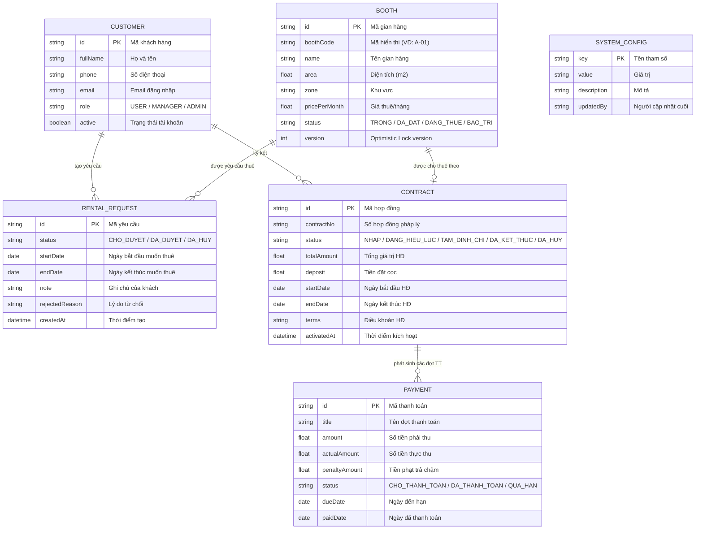
```mermaid
erDiagram
    CUSTOMER {
        string   id          PK  "Mã khách hàng"
        string   fullName        "Họ và tên"
        string   phone           "Số điện thoại"
        string   email           "Email đăng nhập"
        string   role            "USER / MANAGER / ADMIN"
        boolean  active          "Trạng thái tài khoản"
    }

    BOOTH {
        string   id          PK  "Mã gian hàng"
        string   boothCode       "Mã hiển thị (VD: A-01)"
        string   name            "Tên gian hàng"
        float    area            "Diện tích (m2)"
        string   zone            "Khu vực"
        float    pricePerMonth   "Giá thuê/tháng"
        string   status          "TRONG / DA_DAT / DANG_THUE / BAO_TRI"
        int      version         "Optimistic Lock version"
    }

    RENTAL_REQUEST {
        string   id          PK  "Mã yêu cầu"
        string   status          "CHO_DUYET / DA_DUYET / DA_HUY"
        date     startDate       "Ngày bắt đầu muốn thuê"
        date     endDate         "Ngày kết thúc muốn thuê"
        string   note            "Ghi chú của khách"
        string   rejectedReason  "Lý do từ chối"
        datetime createdAt       "Thời điểm tạo"
    }

    CONTRACT {
        string   id          PK  "Mã hợp đồng"
        string   contractNo      "Số hợp đồng pháp lý"
        string   status          "NHAP / DANG_HIEU_LUC / TAM_DINH_CHI / DA_KET_THUC / DA_HUY"
        float    totalAmount     "Tổng giá trị HĐ"
        float    deposit         "Tiền đặt cọc"
        date     startDate       "Ngày bắt đầu HĐ"
        date     endDate         "Ngày kết thúc HĐ"
        string   terms           "Điều khoản HĐ"
        datetime activatedAt     "Thời điểm kích hoạt"
    }

    PAYMENT {
        string   id          PK  "Mã thanh toán"
        string   title           "Tên đợt thanh toán"
        float    amount          "Số tiền phải thu"
        float    actualAmount    "Số tiền thực thu"
        float    penaltyAmount   "Tiền phạt trả chậm"
        string   status          "CHO_THANH_TOAN / DA_THANH_TOAN / QUA_HAN"
        date     dueDate         "Ngày đến hạn"
        date     paidDate        "Ngày đã thanh toán"
    }

    SYSTEM_CONFIG {
        string   key         PK  "Tên tham số"
        string   value           "Giá trị"
        string   description     "Mô tả"
        string   updatedBy       "Người cập nhật cuối"
    }

    CUSTOMER      ||--o{ RENTAL_REQUEST : "tạo yêu cầu"
    CUSTOMER      ||--o{ CONTRACT      : "ký kết"
    BOOTH         ||--o{ RENTAL_REQUEST : "được yêu cầu thuê"
    BOOTH         ||--o|  CONTRACT      : "được cho thuê theo"
    CONTRACT      ||--o{ PAYMENT       : "phát sinh các đợt TT"
```

### 2.2 Sơ đồ Use Case
Tổng quan các tương tác giữa 4 Actor và hệ thống.

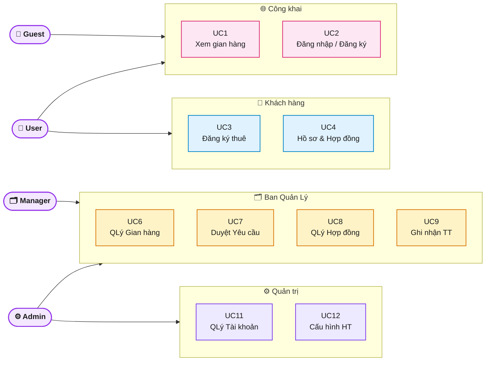
```mermaid
flowchart LR
    classDef actorBox  fill:#f3e8ff,stroke:#9333ea,stroke-width:2px,color:#1a1a1a,font-weight:bold
    classDef guestUC   fill:#fce7f3,stroke:#db2777,stroke-width:1.5px,color:#1a1a1a
    classDef userUC    fill:#e0f2fe,stroke:#0284c7,stroke-width:1.5px,color:#1a1a1a
    classDef mgrUC     fill:#fef3c7,stroke:#d97706,stroke-width:1.5px,color:#1a1a1a
    classDef adminUC   fill:#ede9fe,stroke:#7c3aed,stroke-width:1.5px,color:#1a1a1a

    %% ── Actors ──────────────────────────────────
    G(["👤 Guest"]):::actorBox
    U(["🙋 User"]):::actorBox
    M(["🗂️ Manager"]):::actorBox
    A(["⚙️ Admin"]):::actorBox

    %% ── Use-Cases theo nhóm ─────────────────────
    subgraph PUB ["🌐  Công khai"]
        direction TB
        UC1["UC1\nXem gian hàng"]:::guestUC
        UC2["UC2\nĐăng nhập / Đăng ký"]:::guestUC
    end

    subgraph USR ["🙋  Khách hàng"]
        direction TB
        UC3["UC3\nĐăng ký thuê"]:::userUC
        UC4["UC4\nHồ sơ & Hợp đồng"]:::userUC
    end

    subgraph MGR ["🗂️  Ban Quản Lý"]
        direction TB
        UC6["UC6\nQLý Gian hàng"]:::mgrUC
        UC7["UC7\nDuyệt Yêu cầu"]:::mgrUC
        UC8["UC8\nQLý Hợp đồng"]:::mgrUC
        UC9["UC9\nGhi nhận TT"]:::mgrUC
    end

    subgraph ADM ["⚙️  Quản trị"]
        direction TB
        UC11["UC11\nQLý Tài khoản"]:::adminUC
        UC12["UC12\nCấu hình HT"]:::adminUC
    end

    %% ── Kết nối Actor → Use-Case ────────────────
    G --> PUB
    U --> PUB
    U --> USR
    M --> MGR
    A --> MGR
    A --> ADM
```

### 2.3 Sơ đồ luồng Quy trình thuê gian hàng

> **Màu sắc:** 🔴 Hồng = Guest  |  🔵 Xanh dương = User  |  🟡 Vàng = Manager  |  🟢 Xanh lá = Hệ thống tự động


```mermaid
flowchart TD
    classDef guest   fill:#fce7f3,stroke:#db2777,stroke-width:2px,color:#1a1a1a
    classDef user    fill:#dbeafe,stroke:#2563eb,stroke-width:2px,color:#1a1a1a
    classDef manager fill:#fef9c3,stroke:#ca8a04,stroke-width:2px,color:#1a1a1a
    classDef system  fill:#dcfce7,stroke:#16a34a,stroke-width:2px,color:#1a1a1a
    classDef decide  fill:#fff7ed,stroke:#ea580c,stroke-width:2px,color:#1a1a1a
    classDef finish  fill:#f1f5f9,stroke:#64748b,stroke-width:2px,color:#1a1a1a

    %% ── Bước 1: Khách xem gian hàng ─────────────
    subgraph PHASE1 ["① Tìm & Chọn Gian Hàng"]
        S1(["Xem danh sách\ngian hàng"]):::guest
        D1{"Gian hàng\nTRỐNG?"}:::decide
        S2(["Chọn &\nClick Đăng ký"]):::guest
        S1 --> D1
        D1 -- Không --> S1
        D1 -- Có --> S2
    end

    %% ── Bước 2: Xác thực & Gửi yêu cầu ──────────
    subgraph PHASE2 ["② Xác Thực & Gửi Yêu Cầu"]
        D2{"Đã\nđăng nhập?"}:::decide
        S3(["Đến trang\nLogin / Register"]):::guest
        S4(["Điền Form\nyêu cầu thuê"]):::user
        S5(["Gửi yêu cầu"]):::user
        S6(["🔒 Khóa gian hàng\n→ DA_DAT"]):::system
        D2 -- Chưa --> S3
        S3 --> S4
        D2 -- Rồi --> S4
        S4 --> S5
        S5 --> S6
    end

    %% ── Bước 3: Manager duyệt ─────────────────────
    subgraph PHASE3 ["③ Manager Xét Duyệt"]
        S7(["Xem danh sách\nyêu cầu chờ"]):::manager
        D3{"Quyết định?"}:::decide
        S8(["Từ chối\n+ nhập lý do"]):::manager
        S9(["✅ Duyệt yêu cầu"]):::manager
        S7 --> D3
        D3 -- Từ chối --> S8
        D3 -- Chấp nhận --> S9
    end

    %% ── Bước 4: Tạo & Kích hoạt Hợp đồng ────────
    subgraph PHASE4 ["④ Hợp Đồng & Kích Hoạt"]
        S10(["🖹 Tạo HĐ Nháp\ntự động"]):::system
        S11(["Bổ sung điều khoản\n& tiền cọc"]):::manager
        S12(["Ký kết\nngoài thực tế"]):::manager
        S13(["Kích hoạt HĐ"]):::manager
        S14(["Gian hàng →\nDANG_THUE"]):::system
        S10 --> S11 --> S12 --> S13 --> S14
    end

    %% ── Kết quả từ chối ──────────────────────────
    CANCEL(["❌ Hủy YC\nGian hàng → TRỐNG"]):::finish

    %% ── Kết nối các Phase ────────────────────────
    S2  --> D2
    S6  --> S7
    S8  --> CANCEL
    S9  --> S10
```

### 2.4. Sơ đồ chuyển trạng thái Gian hàng

| Trạng thái | Ký hiệu màu | Ý nghĩa |
|---|---|---|
| **TRỐNG** | 🟢 Xanh lá | Gian hàng sẵn sàng cho thuê |
| **ĐÃ ĐẶT** | 🟡 Vàng | Đang chờ Manager duyệt yêu cầu |
| **ĐANG THUÊ** | 🔴 Đỏ | Hợp đồng đang có hiệu lực |
| **BẢO TRÌ** | ⚫ Xám | Tạm ngưng để sửa chữa |

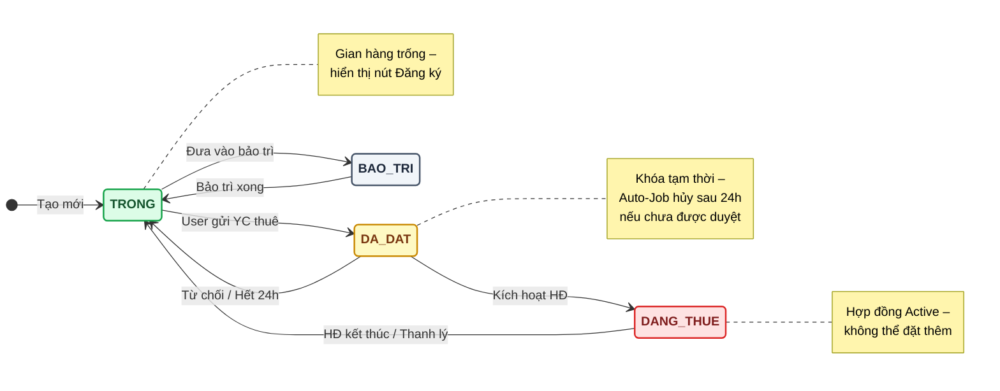
```mermaid
stateDiagram-v2
    direction LR

    classDef available   fill:#dcfce7,stroke:#16a34a,stroke-width:2px,font-weight:bold,color:#14532d
    classDef reserved    fill:#fef9c3,stroke:#ca8a04,stroke-width:2px,font-weight:bold,color:#78350f
    classDef rented      fill:#fee2e2,stroke:#dc2626,stroke-width:2px,font-weight:bold,color:#7f1d1d
    classDef maintenance fill:#f1f5f9,stroke:#475569,stroke-width:2px,font-weight:bold,color:#1e293b

    [*]         --> TRONG       : Tạo mới

    TRONG       --> DA_DAT      : User gửi YC thuê
    TRONG       --> BAO_TRI     : Đưa vào bảo trì

    DA_DAT      --> TRONG       : Từ chối / Hết 24h
    DA_DAT      --> DANG_THUE   : Kích hoạt HĐ

    DANG_THUE   --> TRONG       : HĐ kết thúc / Thanh lý

    BAO_TRI     --> TRONG       : Bảo trì xong

    note right of TRONG
        Gian hàng trống –
        hiển thị nút Đăng ký
    end note

    note right of DA_DAT
        Khóa tạm thời –
        Auto-Job hủy sau 24h
        nếu chưa được duyệt
    end note

    note right of DANG_THUE
        Hợp đồng Active –
        không thể đặt thêm
    end note

    class TRONG       available
    class DA_DAT      reserved
    class DANG_THUE   rented
    class BAO_TRI     maintenance
```

### 2.5. Phân quyền (Roles & Matrix)
#### 2.5.1. Bảng Phân quyền chức năng
Dưới đây là ma trận phân quyền rõ ràng cho 4 nhóm người dùng:

| Chức năng (Module) | System Admin | Manager | User | Guest |
| --- | :---: | :---: | :---: | :---: |
| **Xem danh sách/Chi tiết gian hàng** | Có | Có | Có | Có |
| **Đăng ký tài khoản mới** | - | - | - | Có |
| **Cập nhật Hồ sơ cá nhân (Profile)** | Có | Có | Có | Không |
| **Đăng ký yêu cầu thuê gian hàng** | Không (Chỉ xem) | Có (Tạo hộ) | Có | Không |
| **Xem lịch sử Hợp đồng, Thanh toán** | Có (All) | Có (All) | Chỉ của mình | Không |
| **Quản lý danh mục gian hàng (CRUD)** | Có | Có | Không | Không |
| **Duyệt/Từ chối yêu cầu thuê** | Có | Có | Không | Không |
| **Tạo/Chỉnh sửa/Kích hoạt Hợp đồng** | Có | Có | Không | Không |
| **Ghi nhận thanh toán (Thu tiền)** | Có | Có | Không | Không |
| **Xem Dashboard Báo cáo Doanh thu** | Có | Có | Không | Không |
| **Quản lý nhân viên (Tạo/Khóa acc Manager)**| Có | Không | Không | Không |
| **Cấu hình tham số Hệ thống** | Có | Không | Không | Không |

#### 2.5.2. Phân quyền dữ liệu (Row-Level Security)
- **System Admin / Manager**: Truy cập toàn bộ dữ liệu trên toàn hệ thống (không bị giới hạn).
- **User**: Chỉ được phép thao tác (GET, PUT) lên những Record có `customerId` khớp với ID tài khoản của họ (Token User ID). Bất kỳ nỗ lực nào can thiệp vào Hợp đồng hoặc Yêu cầu của người khác đều bị trả về lỗi `403 Forbidden`.

### 2.6. Site Map (Sơ đồ điều hướng)
- **Guest / User Portal**: 
  - Trang chủ / Danh sách Gian hàng.
  - User Dashboard (Yêu cầu thuê, Hợp đồng, Thanh toán, Profile).
- **Manager Portal**: 
  - CRM Dashboard / Quản lý Gian hàng / Yêu cầu thuê / Quản lý Hợp đồng / Tài chính.
- **System Admin Portal**: 
  - Kế thừa toàn bộ Menu của Manager.
  - Thêm menu: Quản lý Nhân viên (Manager Accounts) / Cấu hình hệ thống (Settings).

---

## PHẦN 2B: SƠ ĐỒ CHI TIẾT TỪNG USE CASE

> Mỗi Use Case được mô tả bằng 3 loại sơ đồ:
> 1. **Sequence Diagram** – Luồng giao tiếp giữa các đối tượng theo thứ tự thời gian.
> 2. **Activity Diagram** – Luồng xử lý logic nghiệp vụ chi tiết (điều kiện, rẽ nhánh).
> 3. **State Diagram** (nếu có) – Chuyển trạng thái dữ liệu liên quan đến Use Case.

---

### UC1 – Xem Danh Sách Gian Hàng

**Actor:** Guest, User  
**Mô tả:** Bất kỳ ai (chưa/đã đăng nhập) đều có thể xem danh sách và chi tiết gian hàng với các bộ lọc tìm kiếm.

#### UC1.1 – Sequence Diagram

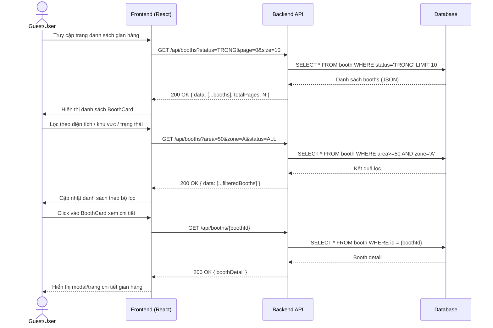
```mermaid
sequenceDiagram
    actor G as Guest/User
    participant FE as Frontend (React)
    participant API as Backend API
    participant DB as Database

    G->>FE: Truy cập trang danh sách gian hàng
    FE->>API: GET /api/booths?status=TRONG&page=0&size=10
    API->>DB: SELECT * FROM booth WHERE status='TRONG' LIMIT 10
    DB-->>API: Danh sách booths (JSON)
    API-->>FE: 200 OK { data: [...booths], totalPages: N }
    FE-->>G: Hiển thị danh sách BoothCard

    G->>FE: Lọc theo diện tích / khu vực / trạng thái
    FE->>API: GET /api/booths?area=50&zone=A&status=ALL
    API->>DB: SELECT * FROM booth WHERE area>=50 AND zone='A'
    DB-->>API: Kết quả lọc
    API-->>FE: 200 OK { data: [...filteredBooths] }
    FE-->>G: Cập nhật danh sách theo bộ lọc

    G->>FE: Click vào BoothCard xem chi tiết
    FE->>API: GET /api/booths/{boothId}
    API->>DB: SELECT * FROM booth WHERE id = {boothId}
    DB-->>API: Booth detail
    API-->>FE: 200 OK { boothDetail }
    FE-->>G: Hiển thị modal/trang chi tiết gian hàng
```

#### UC1.2 – Activity Diagram

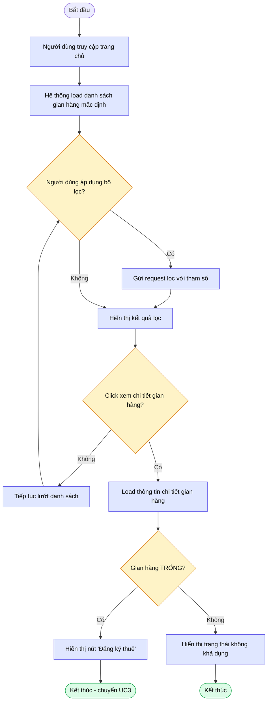
```mermaid
flowchart TD
    classDef action fill:#e0e7ff,stroke:#4f46e5,color:#000
    classDef decision fill:#fef3c7,stroke:#d97706,color:#000
    classDef end_node fill:#dcfce7,stroke:#16a34a,color:#000

    Start([Bắt đầu]) --> A[Người dùng truy cập trang chủ]:::action
    A --> B[Hệ thống load danh sách gian hàng mặc định]:::action
    B --> C{Người dùng áp dụng bộ lọc?}:::decision
    C -- Có --> D[Gửi request lọc với tham số]:::action
    D --> E[Hiển thị kết quả lọc]:::action
    C -- Không --> E
    E --> F{Click xem chi tiết gian hàng?}:::decision
    F -- Không --> G[Tiếp tục lướt danh sách]:::action
    G --> C
    F -- Có --> H[Load thông tin chi tiết gian hàng]:::action
    H --> I{Gian hàng TRỐNG?}:::decision
    I -- Có --> J[Hiển thị nút 'Đăng ký thuê']:::action
    I -- Không --> K[Hiển thị trạng thái không khả dụng]:::action
    J --> End([Kết thúc - chuyển UC3]):::end_node
    K --> End2([Kết thúc]):::end_node
```

---

### UC2 – Đăng Nhập / Đăng Ký

**Actor:** Guest  
**Mô tả:** Guest tạo tài khoản mới hoặc đăng nhập để trở thành User.

#### UC2.1 – Sequence Diagram (Đăng Nhập)

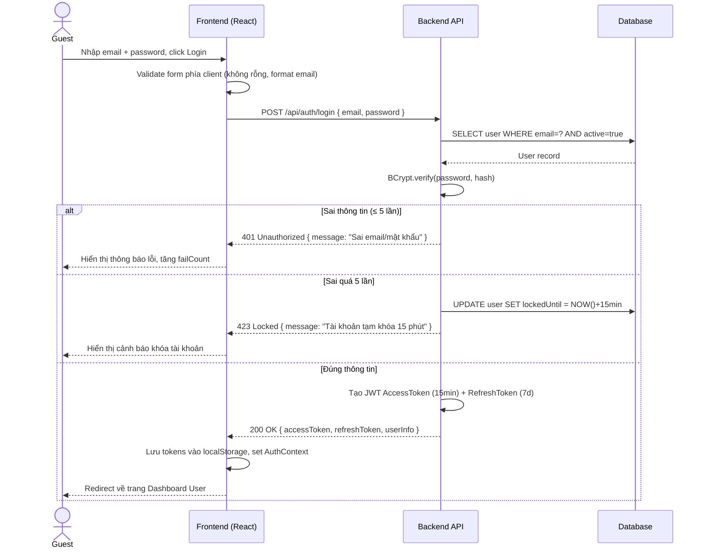
```mermaid
sequenceDiagram
    actor G as Guest
    participant FE as Frontend (React)
    participant API as Backend API
    participant DB as Database

    G->>FE: Nhập email + password, click Login
    FE->>FE: Validate form phía client (không rỗng, format email)
    FE->>API: POST /api/auth/login { email, password }
    API->>DB: SELECT user WHERE email=? AND active=true
    DB-->>API: User record
    API->>API: BCrypt.verify(password, hash)

    alt Sai thông tin (≤ 5 lần)
        API-->>FE: 401 Unauthorized { message: "Sai email/mật khẩu" }
        FE-->>G: Hiển thị thông báo lỗi, tăng failCount
    else Sai quá 5 lần
        API->>DB: UPDATE user SET lockedUntil = NOW()+15min
        API-->>FE: 423 Locked { message: "Tài khoản tạm khóa 15 phút" }
        FE-->>G: Hiển thị cảnh báo khóa tài khoản
    else Đúng thông tin
        API->>API: Tạo JWT AccessToken (15min) + RefreshToken (7d)
        API-->>FE: 200 OK { accessToken, refreshToken, userInfo }
        FE->>FE: Lưu tokens vào localStorage, set AuthContext
        FE-->>G: Redirect về trang Dashboard User
    end
```

#### UC2.2 – Sequence Diagram (Đăng Ký)

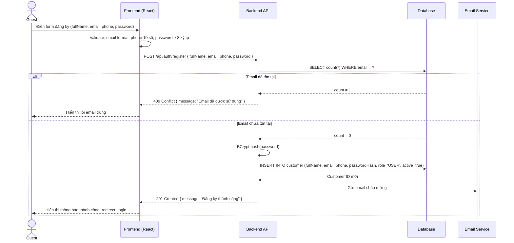
```mermaid
sequenceDiagram
    actor G as Guest
    participant FE as Frontend (React)
    participant API as Backend API
    participant DB as Database
    participant Mail as Email Service

    G->>FE: Điền form đăng ký (fullName, email, phone, password)
    FE->>FE: Validate: email format, phone 10 số, password ≥ 8 ký tự
    FE->>API: POST /api/auth/register { fullName, email, phone, password }
    API->>DB: SELECT count(*) WHERE email = ?
    
    alt Email đã tồn tại
        DB-->>API: count = 1
        API-->>FE: 409 Conflict { message: "Email đã được sử dụng" }
        FE-->>G: Hiển thị lỗi email trùng
    else Email chưa tồn tại
        DB-->>API: count = 0
        API->>API: BCrypt.hash(password)
        API->>DB: INSERT INTO customer (fullName, email, phone, passwordHash, role='USER', active=true)
        DB-->>API: Customer ID mới
        API->>Mail: Gửi email chào mừng
        API-->>FE: 201 Created { message: "Đăng ký thành công" }
        FE-->>G: Hiển thị thông báo thành công, redirect Login
    end
```

#### UC2.3 – Activity Diagram

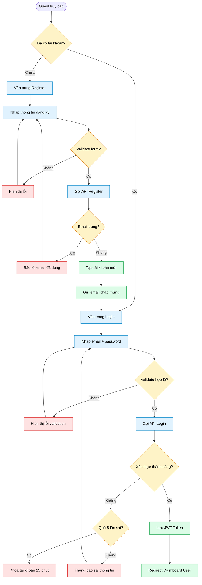
```mermaid
flowchart TD
    classDef action fill:#e0f2fe,stroke:#0284c7,color:#000
    classDef decision fill:#fef3c7,stroke:#d97706,color:#000
    classDef error fill:#fee2e2,stroke:#dc2626,color:#000
    classDef success fill:#dcfce7,stroke:#16a34a,color:#000

    Start([Guest truy cập]) --> A{Đã có tài khoản?}:::decision
    A -- Có --> B[Vào trang Login]:::action
    A -- Chưa --> C[Vào trang Register]:::action

    B --> D[Nhập email + password]:::action
    D --> E{Validate hợp lệ?}:::decision
    E -- Không --> F[Hiển thị lỗi validation]:::error
    F --> D
    E -- Có --> G[Gọi API Login]:::action
    G --> H{Xác thực thành công?}:::decision
    H -- Không --> I{Quá 5 lần sai?}:::decision
    I -- Có --> J[Khóa tài khoản 15 phút]:::error
    I -- Không --> K[Thông báo sai thông tin]:::error
    K --> D
    H -- Có --> L[Lưu JWT Token]:::success
    L --> M[Redirect Dashboard User]:::success

    C --> N[Nhập thông tin đăng ký]:::action
    N --> O{Validate form?}:::decision
    O -- Không --> P[Hiển thị lỗi]:::error
    P --> N
    O -- Có --> Q[Gọi API Register]:::action
    Q --> R{Email trùng?}:::decision
    R -- Có --> S[Báo lỗi email đã dùng]:::error
    S --> N
    R -- Không --> T[Tạo tài khoản mới]:::success
    T --> U[Gửi email chào mừng]:::success
    U --> B
```

---

### UC3 – Đăng Ký Thuê Gian Hàng

**Actor:** User  
**Mô tả:** User đã đăng nhập chọn gian hàng trống và gửi yêu cầu thuê. Hệ thống kiểm tra điều kiện và khóa gian hàng tạm thời.

#### UC3.1 – Sequence Diagram

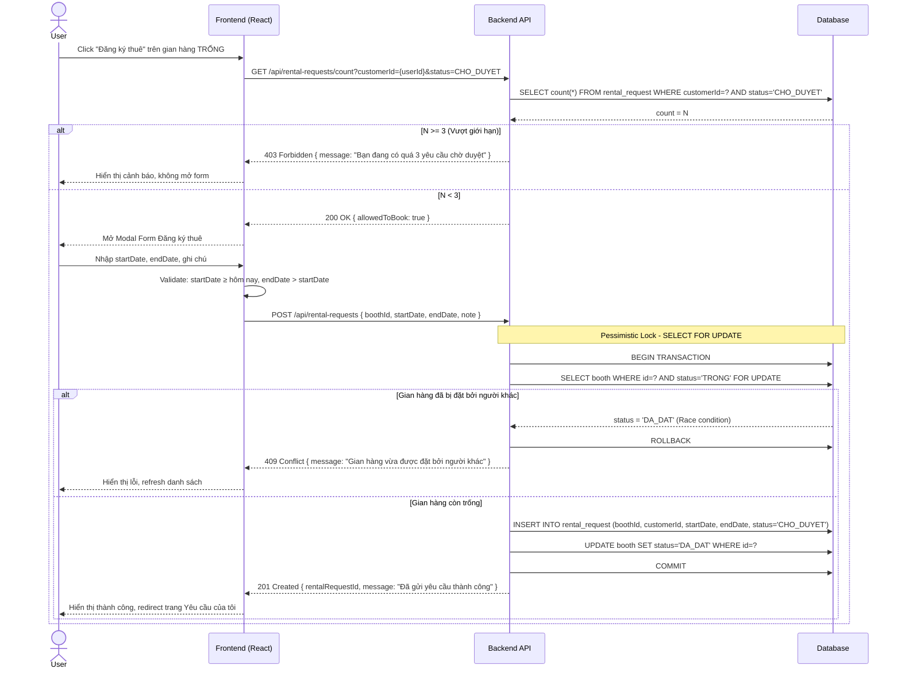
```mermaid
sequenceDiagram
    actor U as User
    participant FE as Frontend (React)
    participant API as Backend API
    participant DB as Database

    U->>FE: Click "Đăng ký thuê" trên gian hàng TRỐNG
    FE->>API: GET /api/rental-requests/count?customerId={userId}&status=CHO_DUYET
    API->>DB: SELECT count(*) FROM rental_request WHERE customerId=? AND status='CHO_DUYET'
    DB-->>API: count = N

    alt N >= 3 (Vượt giới hạn)
        API-->>FE: 403 Forbidden { message: "Bạn đang có quá 3 yêu cầu chờ duyệt" }
        FE-->>U: Hiển thị cảnh báo, không mở form
    else N < 3
        API-->>FE: 200 OK { allowedToBook: true }
        FE-->>U: Mở Modal Form Đăng ký thuê

        U->>FE: Nhập startDate, endDate, ghi chú
        FE->>FE: Validate: startDate ≥ hôm nay, endDate > startDate
        FE->>API: POST /api/rental-requests { boothId, startDate, endDate, note }
        
        Note over API,DB: Pessimistic Lock - SELECT FOR UPDATE
        API->>DB: BEGIN TRANSACTION
        API->>DB: SELECT booth WHERE id=? AND status='TRONG' FOR UPDATE
        
        alt Gian hàng đã bị đặt bởi người khác
            DB-->>API: status = 'DA_DAT' (Race condition)
            API->>DB: ROLLBACK
            API-->>FE: 409 Conflict { message: "Gian hàng vừa được đặt bởi người khác" }
            FE-->>U: Hiển thị lỗi, refresh danh sách
        else Gian hàng còn trống
            API->>DB: INSERT INTO rental_request (boothId, customerId, startDate, endDate, status='CHO_DUYET')
            API->>DB: UPDATE booth SET status='DA_DAT' WHERE id=?
            API->>DB: COMMIT
            API-->>FE: 201 Created { rentalRequestId, message: "Đã gửi yêu cầu thành công" }
            FE-->>U: Hiển thị thành công, redirect trang Yêu cầu của tôi
        end
    end
```

#### UC3.2 – Activity Diagram

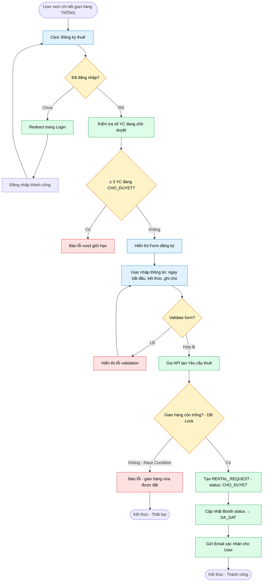
```mermaid
flowchart TD
    classDef user fill:#e0f2fe,stroke:#0284c7,color:#000
    classDef system fill:#dcfce7,stroke:#16a34a,color:#000
    classDef decision fill:#fef3c7,stroke:#d97706,color:#000
    classDef error fill:#fee2e2,stroke:#dc2626,color:#000

    Start([User xem chi tiết gian hàng TRỐNG]) --> A[Click 'Đăng ký thuê']:::user
    A --> B{Đã đăng nhập?}:::decision
    B -- Chưa --> C[Redirect trang Login]:::system
    C --> D[Đăng nhập thành công] --> A
    B -- Rồi --> E[Kiểm tra số YC đang chờ duyệt]:::system
    E --> F{≥ 3 YC đang CHO_DUYET?}:::decision
    F -- Có --> G[Báo lỗi vượt giới hạn]:::error
    F -- Không --> H[Hiển thị Form đăng ký]:::user
    H --> I[User nhập thông tin: ngày bắt đầu, kết thúc, ghi chú]:::user
    I --> J{Validate form?}:::decision
    J -- Lỗi --> K[Hiển thị lỗi validation]:::error
    K --> I
    J -- Hợp lệ --> L[Gọi API tạo Yêu cầu thuê]:::system
    L --> M{Gian hàng còn trống? - DB Lock}:::decision
    M -- Không - Race Condition --> N[Báo lỗi - gian hàng vừa được đặt]:::error
    N --> End1([Kết thúc - Thất bại])
    M -- Có --> O[Tạo RENTAL_REQUEST - status: CHO_DUYET]:::system
    O --> P[Cập nhật Booth status → DA_DAT]:::system
    P --> Q[Gửi Email xác nhận cho User]:::system
    Q --> End2([Kết thúc - Thành công])
```

#### UC3.3 – State Diagram (Vòng đời Yêu Cầu Thuê)

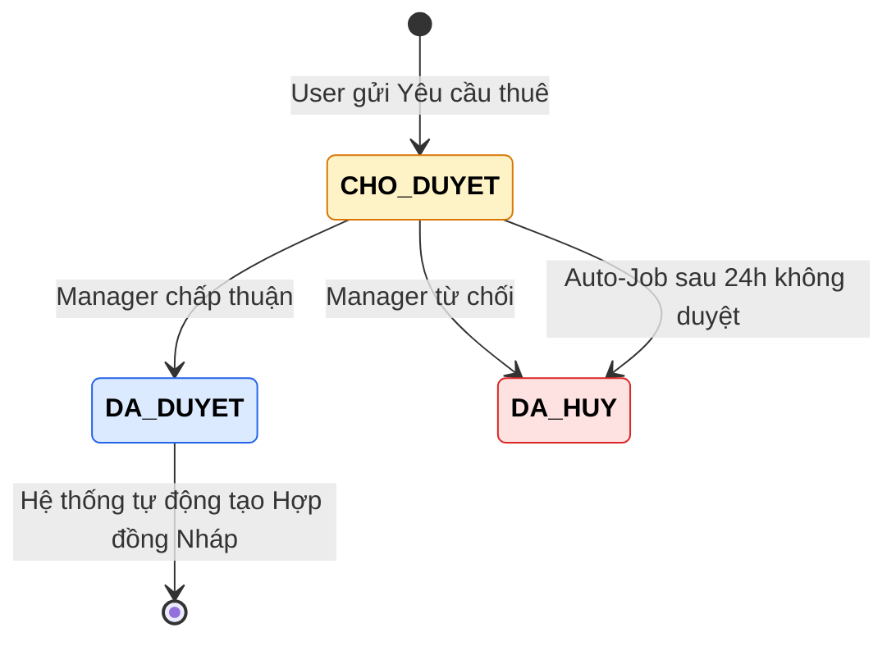
```mermaid
stateDiagram-v2
    classDef pending fill:#fef3c7,stroke:#d97706,font-weight:bold,color:#000
    classDef approved fill:#dbeafe,stroke:#2563eb,font-weight:bold,color:#000
    classDef active fill:#dcfce7,stroke:#16a34a,font-weight:bold,color:#000
    classDef cancelled fill:#fee2e2,stroke:#dc2626,font-weight:bold,color:#000

    [*] --> CHO_DUYET : User gửi Yêu cầu thuê
    CHO_DUYET --> DA_DUYET : Manager chấp thuận
    CHO_DUYET --> DA_HUY : Manager từ chối
    CHO_DUYET --> DA_HUY : Auto-Job sau 24h không duyệt
    DA_DUYET --> [*] : Hệ thống tự động tạo Hợp đồng Nháp

    class CHO_DUYET pending
    class DA_DUYET approved
    class DA_HUY cancelled
```

---

### UC4 – Quản Lý Hồ Sơ & Xem Hợp Đồng (User)

**Actor:** User  
**Mô tả:** User xem và cập nhật hồ sơ cá nhân, tra cứu lịch sử yêu cầu thuê, hợp đồng và trạng thái thanh toán.

#### UC4.1 – Sequence Diagram

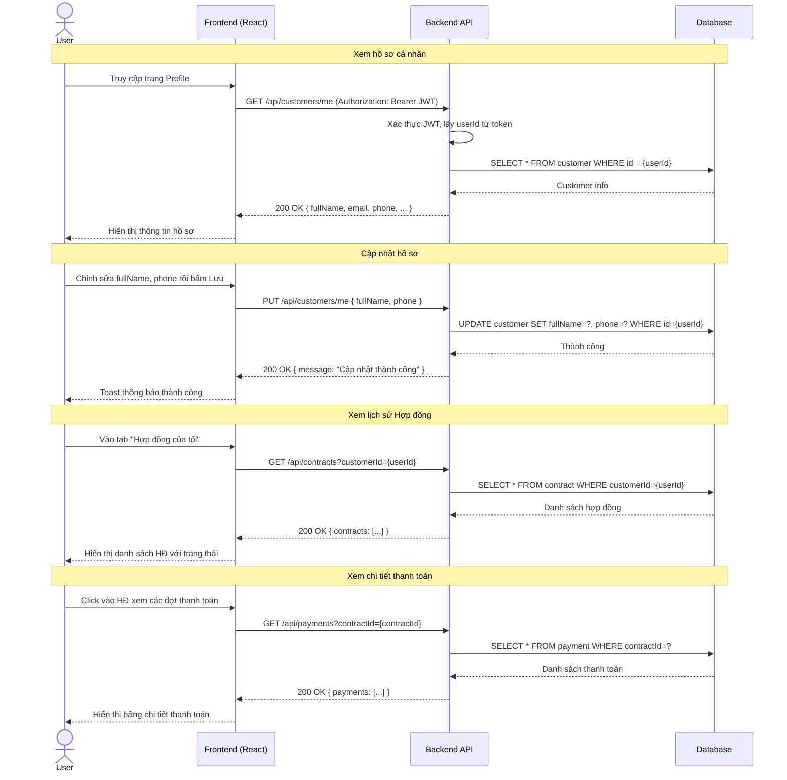
```mermaid
sequenceDiagram
    actor U as User
    participant FE as Frontend (React)
    participant API as Backend API
    participant DB as Database

    Note over U,DB: Xem hồ sơ cá nhân
    U->>FE: Truy cập trang Profile
    FE->>API: GET /api/customers/me (Authorization: Bearer JWT)
    API->>API: Xác thực JWT, lấy userId từ token
    API->>DB: SELECT * FROM customer WHERE id = {userId}
    DB-->>API: Customer info
    API-->>FE: 200 OK { fullName, email, phone, ... }
    FE-->>U: Hiển thị thông tin hồ sơ

    Note over U,DB: Cập nhật hồ sơ
    U->>FE: Chỉnh sửa fullName, phone rồi bấm Lưu
    FE->>API: PUT /api/customers/me { fullName, phone }
    API->>DB: UPDATE customer SET fullName=?, phone=? WHERE id={userId}
    DB-->>API: Thành công
    API-->>FE: 200 OK { message: "Cập nhật thành công" }
    FE-->>U: Toast thông báo thành công

    Note over U,DB: Xem lịch sử Hợp đồng
    U->>FE: Vào tab "Hợp đồng của tôi"
    FE->>API: GET /api/contracts?customerId={userId}
    API->>DB: SELECT * FROM contract WHERE customerId={userId}
    DB-->>API: Danh sách hợp đồng
    API-->>FE: 200 OK { contracts: [...] }
    FE-->>U: Hiển thị danh sách HĐ với trạng thái

    Note over U,DB: Xem chi tiết thanh toán
    U->>FE: Click vào HĐ xem các đợt thanh toán
    FE->>API: GET /api/payments?contractId={contractId}
    API->>DB: SELECT * FROM payment WHERE contractId=?
    DB-->>API: Danh sách thanh toán
    API-->>FE: 200 OK { payments: [...] }
    FE-->>U: Hiển thị bảng chi tiết thanh toán
```

#### UC4.2 – Activity Diagram

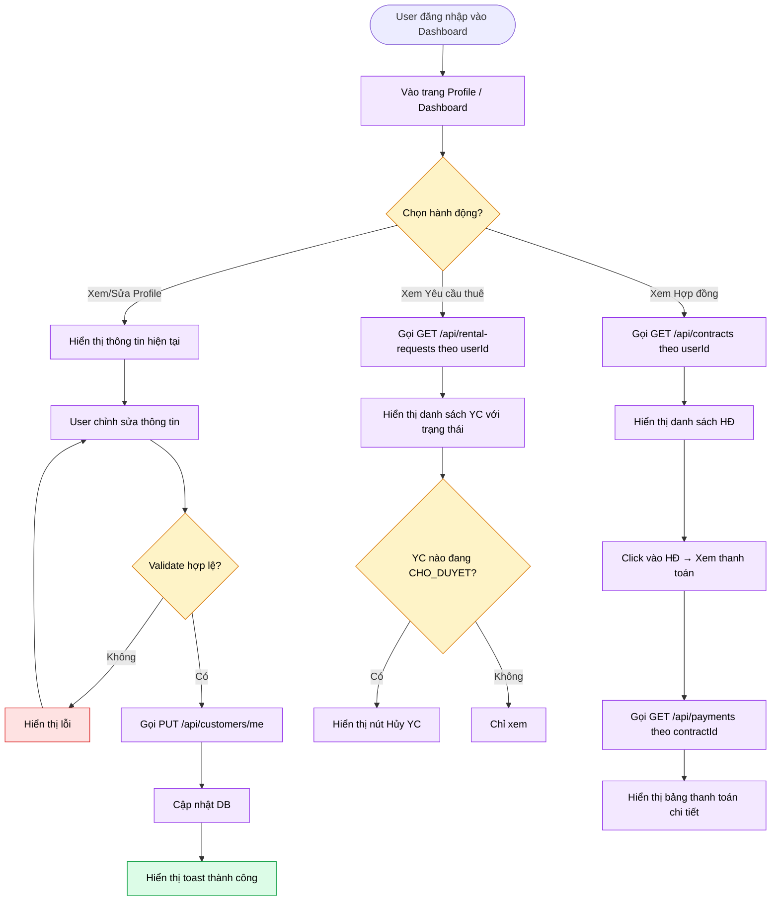
```mermaid
flowchart TD
    classDef action fill:#f3e8ff,stroke:#9333ea,color:#000
    classDef decision fill:#fef3c7,stroke:#d97706,color:#000
    classDef success fill:#dcfce7,stroke:#16a34a,color:#000
    classDef error fill:#fee2e2,stroke:#dc2626,color:#000

    Start([User đăng nhập vào Dashboard]) --> A[Vào trang Profile / Dashboard]:::action
    A --> B{Chọn hành động?}:::decision
    
    B -- Xem/Sửa Profile --> C[Hiển thị thông tin hiện tại]:::action
    C --> D[User chỉnh sửa thông tin]:::action
    D --> E{Validate hợp lệ?}:::decision
    E -- Không --> F[Hiển thị lỗi]:::error
    F --> D
    E -- Có --> G[Gọi PUT /api/customers/me]:::action
    G --> H[Cập nhật DB]:::action
    H --> I[Hiển thị toast thành công]:::success

    B -- Xem Yêu cầu thuê --> J[Gọi GET /api/rental-requests theo userId]:::action
    J --> K[Hiển thị danh sách YC với trạng thái]:::action
    K --> L{YC nào đang CHO_DUYET?}:::decision
    L -- Có --> M[Hiển thị nút Hủy YC]:::action
    L -- Không --> N[Chỉ xem]:::action

    B -- Xem Hợp đồng --> O[Gọi GET /api/contracts theo userId]:::action
    O --> P[Hiển thị danh sách HĐ]:::action
    P --> Q[Click vào HĐ → Xem thanh toán]:::action
    Q --> R[Gọi GET /api/payments theo contractId]:::action
    R --> S[Hiển thị bảng thanh toán chi tiết]:::action
```

---

### UC6 – Quản Lý Danh Mục Gian Hàng (Manager/Admin)

**Actor:** Manager, System Admin  
**Mô tả:** Manager CRUD danh sách gian hàng (thêm, sửa, xóa mềm, tìm kiếm, đổi trạng thái).

#### UC6.1 – Sequence Diagram

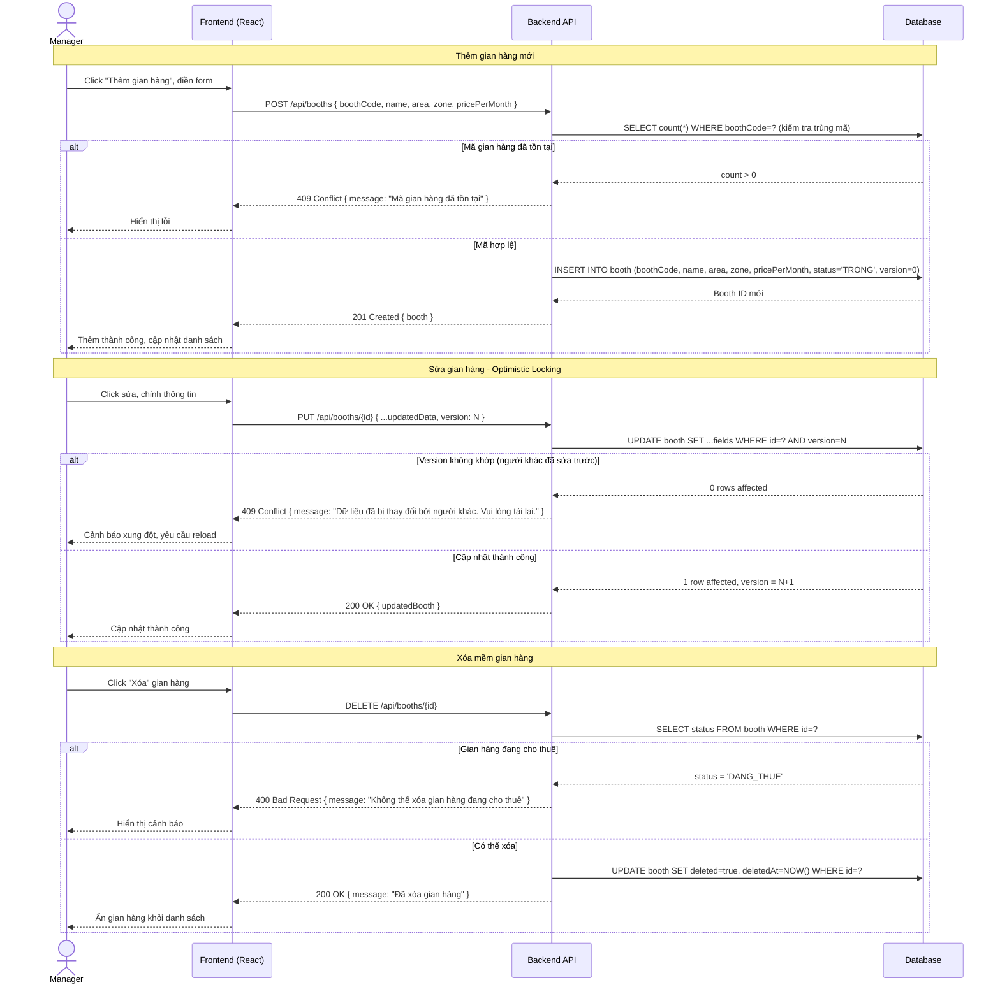
```mermaid
sequenceDiagram
    actor M as Manager
    participant FE as Frontend (React)
    participant API as Backend API
    participant DB as Database

    Note over M,DB: Thêm gian hàng mới
    M->>FE: Click "Thêm gian hàng", điền form
    FE->>API: POST /api/booths { boothCode, name, area, zone, pricePerMonth }
    API->>DB: SELECT count(*) WHERE boothCode=? (kiểm tra trùng mã)
    
    alt Mã gian hàng đã tồn tại
        DB-->>API: count > 0
        API-->>FE: 409 Conflict { message: "Mã gian hàng đã tồn tại" }
        FE-->>M: Hiển thị lỗi
    else Mã hợp lệ
        API->>DB: INSERT INTO booth (boothCode, name, area, zone, pricePerMonth, status='TRONG', version=0)
        DB-->>API: Booth ID mới
        API-->>FE: 201 Created { booth }
        FE-->>M: Thêm thành công, cập nhật danh sách
    end

    Note over M,DB: Sửa gian hàng - Optimistic Locking
    M->>FE: Click sửa, chỉnh thông tin
    FE->>API: PUT /api/booths/{id} { ...updatedData, version: N }
    API->>DB: UPDATE booth SET ...fields WHERE id=? AND version=N
    
    alt Version không khớp (người khác đã sửa trước)
        DB-->>API: 0 rows affected
        API-->>FE: 409 Conflict { message: "Dữ liệu đã bị thay đổi bởi người khác. Vui lòng tải lại." }
        FE-->>M: Cảnh báo xung đột, yêu cầu reload
    else Cập nhật thành công
        DB-->>API: 1 row affected, version = N+1
        API-->>FE: 200 OK { updatedBooth }
        FE-->>M: Cập nhật thành công
    end

    Note over M,DB: Xóa mềm gian hàng
    M->>FE: Click "Xóa" gian hàng
    FE->>API: DELETE /api/booths/{id}
    API->>DB: SELECT status FROM booth WHERE id=?
    
    alt Gian hàng đang cho thuê
        DB-->>API: status = 'DANG_THUE'
        API-->>FE: 400 Bad Request { message: "Không thể xóa gian hàng đang cho thuê" }
        FE-->>M: Hiển thị cảnh báo
    else Có thể xóa
        API->>DB: UPDATE booth SET deleted=true, deletedAt=NOW() WHERE id=?
        API-->>FE: 200 OK { message: "Đã xóa gian hàng" }
        FE-->>M: Ẩn gian hàng khỏi danh sách
    end
```

#### UC6.2 – Activity Diagram

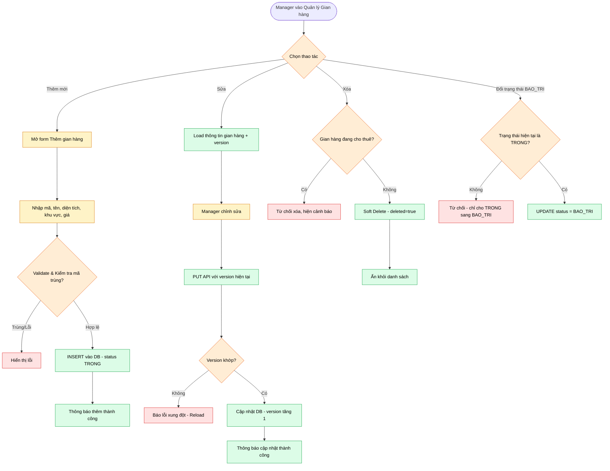
```mermaid
flowchart TD
    classDef manager fill:#fef3c7,stroke:#d97706,color:#000
    classDef system fill:#dcfce7,stroke:#16a34a,color:#000
    classDef decision fill:#ffedd5,stroke:#ea580c,color:#000
    classDef error fill:#fee2e2,stroke:#dc2626,color:#000

    Start([Manager vào Quản lý Gian hàng]) --> A{Chọn thao tác}:::decision

    A -- Thêm mới --> B[Mở form Thêm gian hàng]:::manager
    B --> C[Nhập mã, tên, diện tích, khu vực, giá]:::manager
    C --> D{Validate & Kiểm tra mã trùng?}:::decision
    D -- Trùng/Lỗi --> E[Hiển thị lỗi]:::error
    D -- Hợp lệ --> F[INSERT vào DB - status TRONG]:::system
    F --> G[Thông báo thêm thành công]:::system

    A -- Sửa --> H[Load thông tin gian hàng + version]:::system
    H --> I[Manager chỉnh sửa]:::manager
    I --> J[PUT API với version hiện tại]:::system
    J --> K{Version khớp?}:::decision
    K -- Không --> L[Báo lỗi xung đột - Reload]:::error
    K -- Có --> M[Cập nhật DB - version tăng 1]:::system
    M --> N[Thông báo cập nhật thành công]:::system

    A -- Xóa --> O{Gian hàng đang cho thuê?}:::decision
    O -- Có --> P[Từ chối xóa, hiện cảnh báo]:::error
    O -- Không --> Q[Soft Delete - deleted=true]:::system
    Q --> R[Ẩn khỏi danh sách]:::system

    A -- Đổi trạng thái BAO_TRI --> S{Trạng thái hiện tại là TRONG?}:::decision
    S -- Không --> T[Từ chối - chỉ cho TRONG sang BAO_TRI]:::error
    S -- Có --> U[UPDATE status = BAO_TRI]:::system
```

---

### UC7 – Duyệt Yêu Cầu Thuê

**Actor:** Manager  
**Mô tả:** Manager xem danh sách yêu cầu đang chờ duyệt, xem chi tiết và quyết định chấp nhận hoặc từ chối.

#### UC7.1 – Sequence Diagram

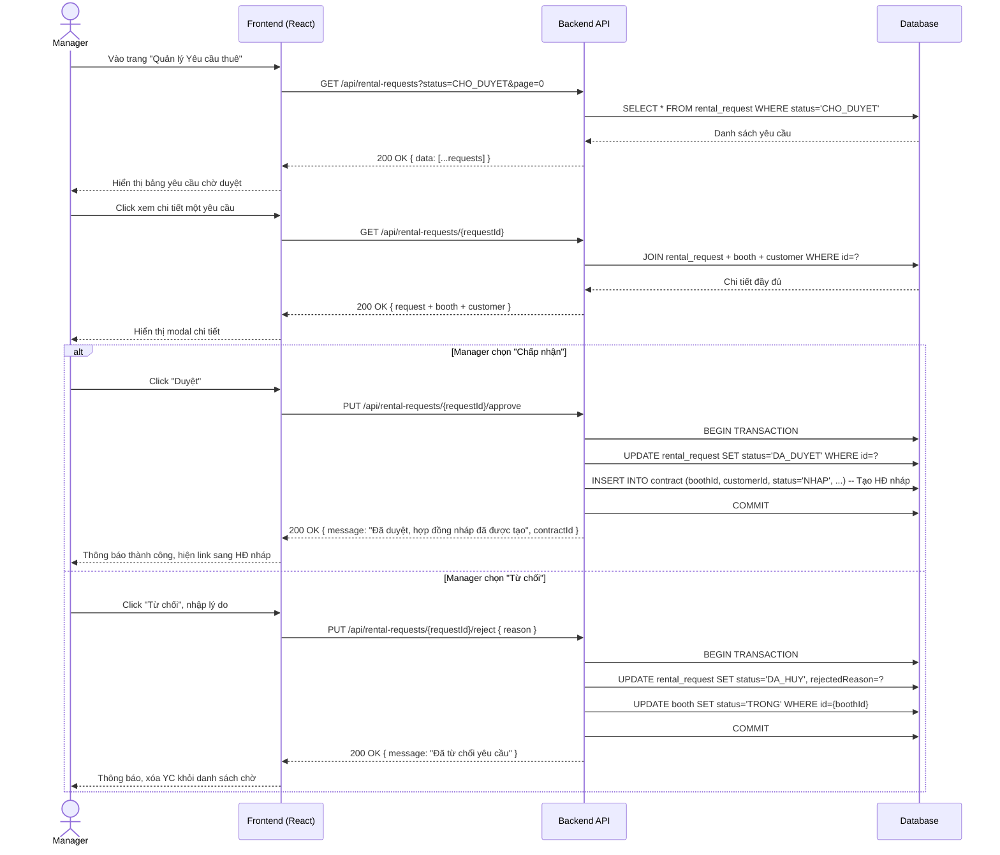
```mermaid
sequenceDiagram
    actor M as Manager
    participant FE as Frontend (React)
    participant API as Backend API
    participant DB as Database

    M->>FE: Vào trang "Quản lý Yêu cầu thuê"
    FE->>API: GET /api/rental-requests?status=CHO_DUYET&page=0
    API->>DB: SELECT * FROM rental_request WHERE status='CHO_DUYET'
    DB-->>API: Danh sách yêu cầu
    API-->>FE: 200 OK { data: [...requests] }
    FE-->>M: Hiển thị bảng yêu cầu chờ duyệt

    M->>FE: Click xem chi tiết một yêu cầu
    FE->>API: GET /api/rental-requests/{requestId}
    API->>DB: JOIN rental_request + booth + customer WHERE id=?
    DB-->>API: Chi tiết đầy đủ
    API-->>FE: 200 OK { request + booth + customer }
    FE-->>M: Hiển thị modal chi tiết

    alt Manager chọn "Chấp nhận"
        M->>FE: Click "Duyệt"
        FE->>API: PUT /api/rental-requests/{requestId}/approve
        API->>DB: BEGIN TRANSACTION
        API->>DB: UPDATE rental_request SET status='DA_DUYET' WHERE id=?
        API->>DB: INSERT INTO contract (boothId, customerId, status='NHAP', ...) -- Tạo HĐ nháp
        API->>DB: COMMIT
        API-->>FE: 200 OK { message: "Đã duyệt, hợp đồng nháp đã được tạo", contractId }
        FE-->>M: Thông báo thành công, hiện link sang HĐ nháp
    else Manager chọn "Từ chối"
        M->>FE: Click "Từ chối", nhập lý do
        FE->>API: PUT /api/rental-requests/{requestId}/reject { reason }
        API->>DB: BEGIN TRANSACTION
        API->>DB: UPDATE rental_request SET status='DA_HUY', rejectedReason=?
        API->>DB: UPDATE booth SET status='TRONG' WHERE id={boothId}
        API->>DB: COMMIT
        API-->>FE: 200 OK { message: "Đã từ chối yêu cầu" }
        FE-->>M: Thông báo, xóa YC khỏi danh sách chờ
    end
```

#### UC7.2 – Activity Diagram

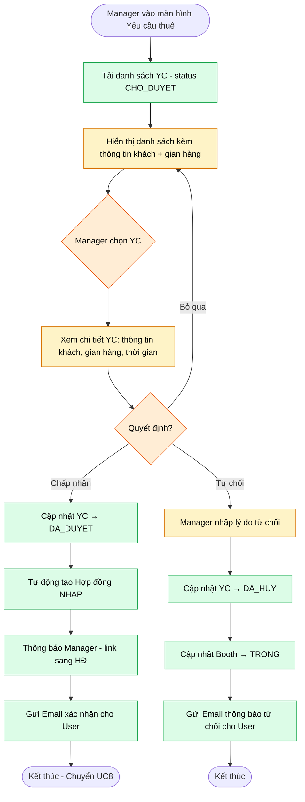
```mermaid
flowchart TD
    classDef manager fill:#fef3c7,stroke:#d97706,color:#000
    classDef system fill:#dcfce7,stroke:#16a34a,color:#000
    classDef decision fill:#ffedd5,stroke:#ea580c,color:#000
    classDef error fill:#fee2e2,stroke:#dc2626,color:#000

    Start([Manager vào màn hình Yêu cầu thuê]) --> A[Tải danh sách YC - status CHO_DUYET]:::system
    A --> B[Hiển thị danh sách kèm thông tin khách + gian hàng]:::manager
    B --> C{Manager chọn YC}:::decision
    C --> D[Xem chi tiết YC: thông tin khách, gian hàng, thời gian]:::manager
    D --> E{Quyết định?}:::decision

    E -- Chấp nhận --> F[Cập nhật YC → DA_DUYET]:::system
    F --> G[Tự động tạo Hợp đồng NHAP]:::system
    G --> H[Thông báo Manager - link sang HĐ]:::system
    H --> I[Gửi Email xác nhận cho User]:::system
    I --> End1([Kết thúc - Chuyển UC8])

    E -- Từ chối --> J[Manager nhập lý do từ chối]:::manager
    J --> K[Cập nhật YC → DA_HUY]:::system
    K --> L[Cập nhật Booth → TRONG]:::system
    L --> M[Gửi Email thông báo từ chối cho User]:::system
    M --> End2([Kết thúc])

    E -- Bỏ qua --> B
```

---

### UC8 – Soạn Thảo & Quản Lý Hợp Đồng

**Actor:** Manager  
**Mô tả:** Manager bổ sung điều khoản vào hợp đồng nháp, ký kết và kích hoạt hợp đồng. Đây là bước chốt chặt ràng buộc pháp lý.

#### UC8.1 – Sequence Diagram

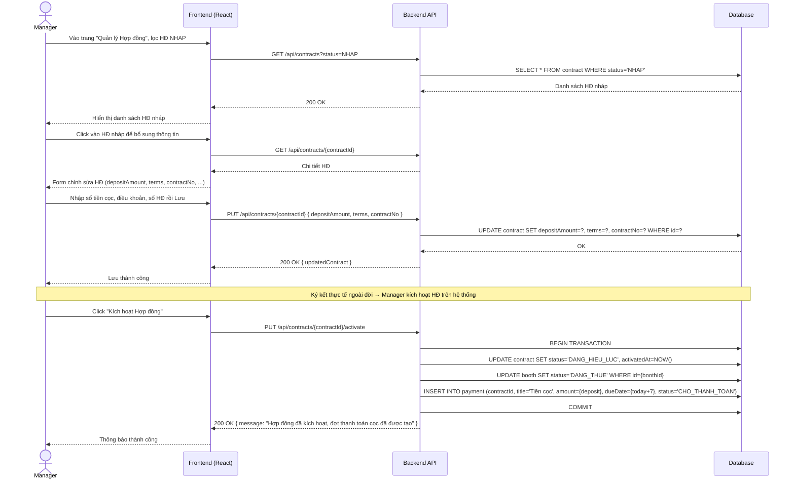
```mermaid
sequenceDiagram
    actor M as Manager
    participant FE as Frontend (React)
    participant API as Backend API
    participant DB as Database

    M->>FE: Vào trang "Quản lý Hợp đồng", lọc HĐ NHAP
    FE->>API: GET /api/contracts?status=NHAP
    API->>DB: SELECT * FROM contract WHERE status='NHAP'
    DB-->>API: Danh sách HĐ nháp
    API-->>FE: 200 OK
    FE-->>M: Hiển thị danh sách HĐ nháp

    M->>FE: Click vào HĐ nháp để bổ sung thông tin
    FE->>API: GET /api/contracts/{contractId}
    API-->>FE: Chi tiết HĐ
    FE-->>M: Form chỉnh sửa HĐ (depositAmount, terms, contractNo, ...)

    M->>FE: Nhập số tiền cọc, điều khoản, số HĐ rồi Lưu
    FE->>API: PUT /api/contracts/{contractId} { depositAmount, terms, contractNo }
    API->>DB: UPDATE contract SET depositAmount=?, terms=?, contractNo=? WHERE id=?
    DB-->>API: OK
    API-->>FE: 200 OK { updatedContract }
    FE-->>M: Lưu thành công

    Note over M,DB: Ký kết thực tế ngoài đời → Manager kích hoạt HĐ trên hệ thống
    M->>FE: Click "Kích hoạt Hợp đồng"
    FE->>API: PUT /api/contracts/{contractId}/activate
    API->>DB: BEGIN TRANSACTION
    API->>DB: UPDATE contract SET status='DANG_HIEU_LUC', activatedAt=NOW()
    API->>DB: UPDATE booth SET status='DANG_THUE' WHERE id={boothId}
    API->>DB: INSERT INTO payment (contractId, title='Tiền cọc', amount={deposit}, dueDate={today+7}, status='CHO_THANH_TOAN')
    API->>DB: COMMIT
    API-->>FE: 200 OK { message: "Hợp đồng đã kích hoạt, đợt thanh toán cọc đã được tạo" }
    FE-->>M: Thông báo thành công
```

#### UC8.2 – Activity Diagram

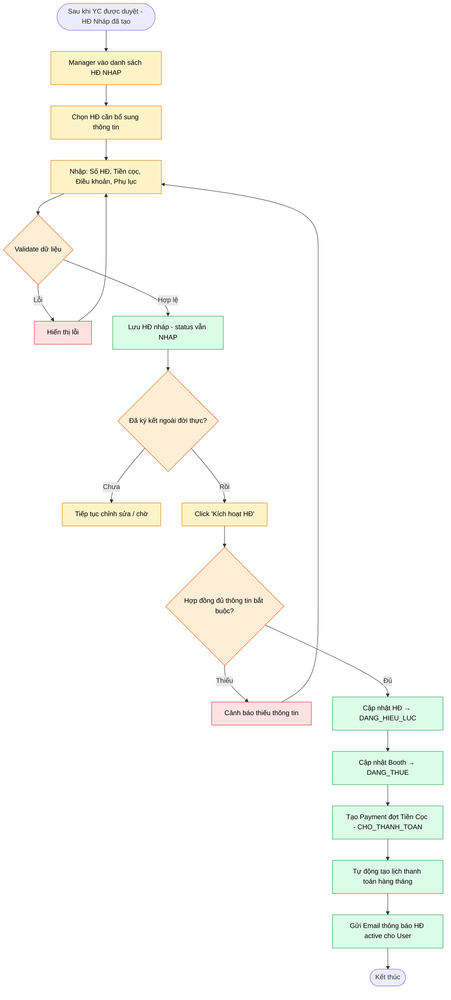
```mermaid
flowchart TD
    classDef manager fill:#fef3c7,stroke:#d97706,color:#000
    classDef system fill:#dcfce7,stroke:#16a34a,color:#000
    classDef decision fill:#ffedd5,stroke:#ea580c,color:#000
    classDef error fill:#fee2e2,stroke:#dc2626,color:#000

    Start([Sau khi YC được duyệt - HĐ Nháp đã tạo]) --> A[Manager vào danh sách HĐ NHAP]:::manager
    A --> B[Chọn HĐ cần bổ sung thông tin]:::manager
    B --> C[Nhập: Số HĐ, Tiền cọc, Điều khoản, Phụ lục]:::manager
    C --> D{Validate dữ liệu}:::decision
    D -- Lỗi --> E[Hiển thị lỗi]:::error
    E --> C
    D -- Hợp lệ --> F[Lưu HĐ nháp - status vẫn NHAP]:::system
    F --> G{Đã ký kết ngoài đời thực?}:::decision
    G -- Chưa --> H[Tiếp tục chỉnh sửa / chờ]:::manager
    G -- Rồi --> I[Click 'Kích hoạt HĐ']:::manager
    I --> J{Hợp đồng đủ thông tin bắt buộc?}:::decision
    J -- Thiếu --> K[Cảnh báo thiếu thông tin]:::error
    K --> C
    J -- Đủ --> L[Cập nhật HĐ → DANG_HIEU_LUC]:::system
    L --> M[Cập nhật Booth → DANG_THUE]:::system
    M --> N[Tạo Payment đợt Tiền Cọc - CHO_THANH_TOAN]:::system
    N --> O[Tự động tạo lịch thanh toán hàng tháng]:::system
    O --> P[Gửi Email thông báo HĐ active cho User]:::system
    P --> End([Kết thúc])
```

#### UC8.3 – State Diagram (Vòng đời Hợp Đồng)

```mermaid
stateDiagram-v2
    classDef draft fill:#f3f4f6,stroke:#6b7280,font-weight:bold,color:#000
    classDef active fill:#dcfce7,stroke:#16a34a,font-weight:bold,color:#000
    classDef suspended fill:#fef3c7,stroke:#d97706,font-weight:bold,color:#000
    classDef terminated fill:#fee2e2,stroke:#dc2626,font-weight:bold,color:#000

    [*] --> NHAP : Tạo tự động sau khi duyệt YC
    NHAP --> DANG_HIEU_LUC : Manager kích hoạt (Activate)
    NHAP --> DA_HUY : Manager hủy HĐ nháp
    DANG_HIEU_LUC --> TAM_DINH_CHI : Manager tạm đình chỉ (vi phạm)
    TAM_DINH_CHI --> DANG_HIEU_LUC : Manager khôi phục
    DANG_HIEU_LUC --> DA_KET_THUC : Hết ngày kết thúc / Thanh lý
    DA_HUY --> [*]
    DA_KET_THUC --> [*]

    class NHAP draft
    class DANG_HIEU_LUC active
    class TAM_DINH_CHI suspended
    class DA_HUY terminated
    class DA_KET_THUC terminated
```

---

### UC9 – Ghi Nhận Thanh Toán

**Actor:** Manager  
**Mô tả:** Manager xác nhận thu tiền từ khách hàng cho từng đợt thanh toán (cọc, hàng tháng, phạt).

#### UC9.1 – Sequence Diagram

```mermaid
sequenceDiagram
    actor M as Manager
    participant FE as Frontend (React)
    participant API as Backend API
    participant DB as Database

    M->>FE: Vào trang "Quản lý Thanh toán", lọc CHO_THANH_TOAN
    FE->>API: GET /api/payments?status=CHO_THANH_TOAN
    API->>DB: SELECT p.*, c.contractNo, cu.fullName FROM payment p JOIN contract c JOIN customer cu WHERE p.status='CHO_THANH_TOAN'
    DB-->>API: Danh sách khoản cần thu
    API-->>FE: 200 OK { payments }
    FE-->>M: Hiển thị bảng thu tiền

    M->>FE: Chọn một đợt, nhập số tiền thực thu và ghi chú
    FE->>FE: Validate: actualAmount > 0
    FE->>API: PUT /api/payments/{paymentId}/confirm { actualAmount, paidDate, note }
    API->>DB: SELECT status FROM payment WHERE id=?
    
    alt Đợt thanh toán đã được xác nhận trước đó
        DB-->>API: status = 'DA_THANH_TOAN'
        API-->>FE: 400 Bad Request { message: "Khoản thanh toán này đã được ghi nhận" }
        FE-->>M: Hiển thị cảnh báo
    else Đợt còn chờ
        API->>DB: UPDATE payment SET status='DA_THANH_TOAN', actualAmount=?, paidDate=?, note=?, confirmedBy={managerId}
        DB-->>API: OK
        API-->>FE: 200 OK { message: "Ghi nhận thanh toán thành công" }
        FE-->>M: Toast thành công, cập nhật bảng
    end

    Note over M,DB: Xem khoản quá hạn
    M->>FE: Lọc QUA_HAN
    FE->>API: GET /api/payments?status=QUA_HAN
    API->>DB: SELECT * FROM payment WHERE status='QUA_HAN'
    DB-->>API: Danh sách quá hạn với penaltyAmount
    API-->>FE: 200 OK
    FE-->>M: Hiển thị cột Tiền phạt + Tổng phải thu
```

#### UC9.2 – Activity Diagram

```mermaid
flowchart TD
    classDef manager fill:#fef3c7,stroke:#d97706,color:#000
    classDef system fill:#dcfce7,stroke:#16a34a,color:#000
    classDef decision fill:#ffedd5,stroke:#ea580c,color:#000
    classDef error fill:#fee2e2,stroke:#dc2626,color:#000

    Start([Manager vào Quản lý Thanh toán]) --> A[Tải danh sách đợt thanh toán]:::system
    A --> B{Lọc theo trạng thái}:::decision
    B -- CHO_THANH_TOAN --> C[Hiển thị các khoản đến hạn]:::manager
    B -- QUA_HAN --> D[Hiển thị khoản quá hạn + số tiền phạt]:::manager
    B -- Tất cả --> E[Hiển thị toàn bộ lịch sử]:::manager

    C --> F[Manager chọn đợt cần xác nhận]:::manager
    F --> G[Nhập: Số tiền thực thu, Ngày thu, Ghi chú]:::manager
    G --> H{Validate: actualAmount > 0?}:::decision
    H -- Không --> I[Hiển thị lỗi]:::error
    I --> G
    H -- Có --> J{Đợt đã được xác nhận rồi?}:::decision
    J -- Có --> K[Báo lỗi toàn vẹn dữ liệu]:::error
    J -- Chưa --> L[UPDATE status → DA_THANH_TOAN]:::system
    L --> M[Lưu: actualAmount, paidDate, confirmedBy]:::system
    M --> N[Thông báo thành công]:::system
    N --> O{Còn khoản nào cần thu?}:::decision
    O -- Có --> F
    O -- Không --> End([Kết thúc])

    D --> P[Xem chi tiết khoản quá hạn]:::manager
    P --> Q{Manager xác nhận thu bao gồm phạt?}:::decision
    Q -- Có --> F
    Q -- Không --> End
```

#### UC9.3 – State Diagram (Vòng đời Thanh Toán)

```mermaid
stateDiagram-v2
    classDef pending fill:#fef3c7,stroke:#d97706,font-weight:bold,color:#000
    classDef overdue fill:#fee2e2,stroke:#dc2626,font-weight:bold,color:#000
    classDef paid fill:#dcfce7,stroke:#16a34a,font-weight:bold,color:#000

    [*] --> CHO_THANH_TOAN : Tạo khi HĐ kích hoạt hoặc đến kỳ
    CHO_THANH_TOAN --> DA_THANH_TOAN : Manager xác nhận thu tiền
    CHO_THANH_TOAN --> QUA_HAN : Cron Job 00:01 – quá dueDate
    QUA_HAN --> DA_THANH_TOAN : Manager thu tiền + phạt
    DA_THANH_TOAN --> [*]

    class CHO_THANH_TOAN pending
    class QUA_HAN overdue
    class DA_THANH_TOAN paid
```

---

### UC11 – Quản Lý User (Admin)

**Actor:** System Admin  
**Mô tả:** Admin quản lý toàn bộ tài khoản trong hệ thống: tạo tài khoản Manager, khóa/mở tài khoản, xem danh sách User.

#### UC11.1 – Sequence Diagram

```mermaid
sequenceDiagram
    actor A as System Admin
    participant FE as Frontend (React)
    participant API as Backend API
    participant DB as Database
    participant Mail as Email Service

    Note over A,DB: Tạo tài khoản Manager
    A->>FE: Vào trang "Quản lý nhân viên", click Thêm Manager
    FE->>API: POST /api/admin/users { fullName, email, phone, role='MANAGER' }
    API->>DB: SELECT count(*) WHERE email=?
    
    alt Email trùng
        DB-->>API: count > 0
        API-->>FE: 409 Conflict
        FE-->>A: Báo email đã tồn tại
    else Email mới
        API->>API: Tạo mật khẩu ngẫu nhiên, BCrypt hash
        API->>DB: INSERT INTO customer (fullName, email, phone, passwordHash, role='MANAGER', active=true)
        API->>Mail: Gửi email với thông tin đăng nhập lần đầu
        API-->>FE: 201 Created
        FE-->>A: Thông báo tạo thành công
    end

    Note over A,DB: Khóa tài khoản Manager
    A->>FE: Click "Khóa" một tài khoản Manager
    FE->>FE: Hiển thị dialog xác nhận
    A->>FE: Xác nhận
    FE->>API: PUT /api/admin/users/{userId}/deactivate
    API->>DB: SELECT role FROM customer WHERE id=?
    
    alt Cố khóa tài khoản Admin duy nhất
        DB-->>API: role='ADMIN' + count(ADMIN)=1
        API-->>FE: 400 Bad Request { message: "Không thể khóa Admin duy nhất" }
        FE-->>A: Hiển thị cảnh báo
    else Được phép khóa
        API->>DB: UPDATE customer SET active=false, lockedAt=NOW() WHERE id=?
        API-->>FE: 200 OK
        FE-->>A: Cập nhật trạng thái trong bảng
    end
```

#### UC11.2 – Activity Diagram

```mermaid
flowchart TD
    classDef admin fill:#f3e8ff,stroke:#9333ea,color:#000
    classDef system fill:#dcfce7,stroke:#16a34a,color:#000
    classDef decision fill:#fef3c7,stroke:#d97706,color:#000
    classDef error fill:#fee2e2,stroke:#dc2626,color:#000

    Start([Admin vào Quản lý Nhân viên]) --> A[Tải danh sách tài khoản]:::system
    A --> B[Hiển thị bảng: Họ tên, Role, Trạng thái, Ngày tạo]:::admin
    B --> C{Chọn hành động}:::decision

    C -- Thêm Manager --> D[Mở form Thêm tài khoản]:::admin
    D --> E[Nhập fullName, email, phone]:::admin
    E --> F{Email hợp lệ & chưa tồn tại?}:::decision
    F -- Không --> G[Báo lỗi]:::error
    G --> E
    F -- Có --> H[Tạo tài khoản Manager + password ngẫu nhiên]:::system
    H --> I[Gửi email thông tin đăng nhập]:::system
    I --> J[Hiển thị thành công]:::system

    C -- Khóa tài khoản --> K[Hiển thị dialog xác nhận]:::admin
    K --> L{Tài khoản là Admin duy nhất?}:::decision
    L -- Có --> M[Từ chối khóa, hiện cảnh báo]:::error
    L -- Không --> N[UPDATE active=false]:::system
    N --> O[Thông báo đã khóa]:::system

    C -- Mở khóa --> P[UPDATE active=true]:::system
    P --> Q[Thông báo đã mở khóa]:::system

    C -- Xem chi tiết --> R[Hiển thị hồ sơ đầy đủ + lịch sử thao tác]:::admin
```

---

### UC12 – Cấu Hình Hệ Thống (Admin)

**Actor:** System Admin  
**Mô tả:** Admin cấu hình các tham số động của hệ thống: % phạt trả chậm, thời gian tự hủy yêu cầu, VAT, giới hạn booking.

#### UC12.1 – Sequence Diagram

```mermaid
sequenceDiagram
    actor A as System Admin
    participant FE as Frontend (React)
    participant API as Backend API
    participant DB as Database
    participant Cache as In-Memory Cache

    A->>FE: Vào trang "Cấu hình hệ thống"
    FE->>API: GET /api/admin/system-configs
    API->>Cache: Kiểm tra cache cấu hình
    
    alt Cache miss
        Cache-->>API: miss
        API->>DB: SELECT * FROM system_configs
        DB-->>API: Danh sách cấu hình (key-value)
        API->>Cache: Lưu vào cache (TTL=5min)
    else Cache hit
        Cache-->>API: Trả về từ cache
    end
    
    API-->>FE: 200 OK { configs: [{key, value, description},...] }
    FE-->>A: Hiển thị form cấu hình

    A->>FE: Thay đổi giá trị (vd: penaltyRate = 2%, autoReleaseHours = 48)
    FE->>FE: Validate: số dương, trong phạm vi hợp lệ
    FE->>API: PUT /api/admin/system-configs { key: 'PENALTY_RATE', value: '2.0' }
    API->>DB: UPDATE system_configs SET value='2.0', updatedBy={adminId}, updatedAt=NOW() WHERE key='PENALTY_RATE'
    API->>Cache: Xóa cache cũ (invalidate)
    DB-->>API: OK
    API-->>FE: 200 OK { message: "Cấu hình đã được cập nhật" }
    FE-->>A: Toast thành công, hiển thị giá trị mới
```

#### UC12.2 – Activity Diagram

```mermaid
flowchart TD
    classDef admin fill:#f3e8ff,stroke:#9333ea,color:#000
    classDef system fill:#dcfce7,stroke:#16a34a,color:#000
    classDef decision fill:#fef3c7,stroke:#d97706,color:#000
    classDef error fill:#fee2e2,stroke:#dc2626,color:#000

    Start([Admin vào Cấu hình hệ thống]) --> A[Load danh sách tham số từ DB/Cache]:::system
    A --> B[Hiển thị bảng tham số dạng form]:::admin
    B --> C{Admin chỉnh sửa tham số}:::decision

    C -- Tỷ lệ phạt trả chậm --> D[Nhập % phạt mới]:::admin
    D --> E{0% ≤ giá trị ≤ 100%?}:::decision
    E -- Không --> F[Báo lỗi phạm vi]:::error
    E -- Có --> G[Lưu PENALTY_RATE]:::system

    C -- Thời gian tự hủy YC --> H[Nhập số giờ mới]:::admin
    H --> I{Giá trị từ 1 đến 168 giờ?}:::decision
    I -- Không --> J[Báo lỗi]:::error
    I -- Có --> K[Lưu AUTO_RELEASE_HOURS]:::system

    C -- Thuế VAT --> L[Nhập % VAT mới]:::admin
    L --> M{0% ≤ VAT ≤ 50%?}:::decision
    M -- Không --> N[Báo lỗi]:::error
    M -- Có --> O[Lưu VAT_RATE]:::system

    C -- Giới hạn Booking --> P[Nhập số YC tối đa mỗi User]:::admin
    P --> Q{1 ≤ giá trị ≤ 10?}:::decision
    Q -- Không --> R[Báo lỗi]:::error
    Q -- Có --> S[Lưu MAX_PENDING_REQUESTS]:::system

    G --> T[Invalidate Cache]:::system
    K --> T
    O --> T
    S --> T
    T --> U[Ghi log audit: ai sửa, lúc nào, giá trị cũ/mới]:::system
    U --> V[Thông báo cập nhật thành công]:::system
    V --> End([Kết thúc])
```

---

### BACKGROUND JOBS – Sơ Đồ Luồng Tự Động

**Mô tả:** Các tác vụ chạy tự động theo lịch, không cần tác nhân người dùng.

#### BG-JOB-1 – Auto Release (Mỗi giờ)

```mermaid
flowchart TD
    classDef cron fill:#f0f9ff,stroke:#0369a1,color:#000
    classDef action fill:#dcfce7,stroke:#16a34a,color:#000
    classDef decision fill:#fef3c7,stroke:#d97706,color:#000

    Start([Cron trigger mỗi giờ]) --> A[Query: Tìm RENTAL_REQUEST tạo > 24h mà status=CHO_DUYET]:::cron
    A --> B{Có kết quả?}:::decision
    B -- Không --> End([Sleep đến lần sau])
    B -- Có --> C[Lặp qua từng Request]:::action
    C --> D[Cập nhật status → DA_HUY, reason='Hết thời hạn duyệt tự động']:::action
    D --> E[Cập nhật Booth SET status='TRONG']:::action
    E --> F[Ghi log hệ thống]:::action
    F --> G{Còn request tiếp theo?}:::decision
    G -- Có --> C
    G -- Không --> End2([Hoàn thành])
```

#### BG-JOB-2 – Debt Scanner (Mỗi ngày 00:01)

```mermaid
flowchart TD
    classDef cron fill:#f0f9ff,stroke:#0369a1,color:#000
    classDef action fill:#dcfce7,stroke:#16a34a,color:#000
    classDef decision fill:#fef3c7,stroke:#d97706,color:#000
    classDef calc fill:#fef9c3,stroke:#ca8a04,color:#000

    Start([Cron trigger 00:01 hàng ngày]) --> A[Query: Tìm PAYMENT status=CHO_THANH_TOAN mà dueDate < NOW]:::cron
    A --> B{Có kết quả?}:::decision
    B -- Không --> End([Sleep đến ngày mai])
    B -- Có --> C[Lặp qua từng Payment quá hạn]:::action
    C --> D[Tính số ngày quá hạn]:::calc
    D --> E[Lấy PENALTY_RATE từ system_configs]:::calc
    E --> F[penaltyAmount = amount × penaltyRate × days]:::calc
    F --> G[Cập nhật: status='QUA_HAN', penaltyAmount=?, updatedAt=NOW]:::action
    G --> H{Còn payment tiếp theo?}:::decision
    H -- Có --> C
    H -- Không --> I[Ghi log audit quét công nợ]:::action
    I --> End2([Hoàn thành])
```

#### BG-JOB-3 – Notifier (Trước ngày đến hạn 3 ngày)

```mermaid
flowchart TD
    classDef cron fill:#f0f9ff,stroke:#0369a1,color:#000
    classDef action fill:#dcfce7,stroke:#16a34a,color:#000
    classDef decision fill:#fef3c7,stroke:#d97706,color:#000

    Start([Cron trigger hàng ngày 08:00]) --> A[Query: Payment CHO_THANH_TOAN, dueDate = TODAY+3]:::cron
    A --> B[Query: Contract DANG_HIEU_LUC, endDate = TODAY+7]:::cron
    B --> C{Có kết quả?}:::decision
    C -- Không --> End([Kết thúc])
    C -- Có --> D[Lặp qua danh sách cần nhắc]:::action
    D --> E[Lấy email của customer tương ứng]:::action
    E --> F{Loại thông báo?}:::decision
    F -- Thanh toán đến hạn --> G[Gửi Email nhắc thanh toán]:::action
    F -- HĐ sắp hết hạn --> H[Gửi Email nhắc gia hạn HĐ]:::action
    G --> I{Còn bản ghi tiếp theo?}:::decision
    H --> I
    I -- Có --> D
    I -- Không --> J[Ghi log số email đã gửi]:::action
    J --> End2([Kết thúc])
```

---

| Mã | Tên chức năng | Phân hệ | Tác nhân (Actor) |
| --- | --- | --- | --- |
| SYS-01| Quản trị hệ thống & Nhân sự | Admin | System Admin |
| GH-01 | Quản lý danh mục gian hàng | BQL | Manager, Admin |
| GH-02 | Đăng ký thuê gian hàng | Customer | User |
| HD-01 | Quản lý vòng đời hợp đồng | BQL | Manager, Admin |
| TT-01 | Quản lý thanh toán & Công nợ | BQL | Manager, Admin |

---
### 3.1. QUẢN TRỊ HỆ THỐNG (SYS-01) - Dành riêng cho Admin
#### 3.1.1. Logic nghiệp vụ
- **Mô tả**: Admin có quyền tạo tài khoản cấp phát cho các Manager, khóa tài khoản nếu nhân viên nghỉ việc. Thay đổi các hằng số (Constants) của hệ thống.
- **Quy tắc (Business Rules)**:
  - Chỉ `ROLE_ADMIN` mới truy cập được API này.
  - Cấu hình tham số động: Admin có thể set `% Phạt trả chậm`, `Thời gian tự động Hủy yêu cầu (Mặc định 24h)`, `Thuế VAT` trực tiếp trên UI thay vì hardcode trong code. Các biến này được lưu ở bảng `system_configs`.
  - Không được phép tự xóa tài khoản Admin duy nhất của hệ thống.

---
### 3.2. QUẢN LÝ DANH MỤC GIAN HÀNG (GH-01)
#### 3.2.1. Logic nghiệp vụ
- **Mô tả**: Manager Thêm, Sửa, Xóa mềm và Xem danh sách gian hàng.
- **Quy tắc**: 
  - **Concurrency Control**: Sử dụng Optimistic Locking (`@Version` trong JPA) để tránh 2 Manager cùng sửa 1 gian hàng.
  - KHÔNG ĐƯỢC XÓA gian hàng nếu trạng thái đang là `ĐANG THUÊ`.

---
### 3.3. ĐĂNG KÝ THUÊ GIAN HÀNG (GH-02)
#### 3.3.1. Logic nghiệp vụ
- **Mô tả**: User chọn gian hàng trống và gửi yêu cầu đăng ký thuê.
- **Quy tắc**:
  - **Spam Prevention**: 1 User chỉ được gửi tối đa **3** Yêu cầu đang `CHO_DUYET`. Vượt quá chặn `403`.
  - **Auto Lock**: Ngay khi User tạo `RENTAL_REQUEST`, gian hàng chuyển thành `DA_DAT`.
  - **Race Condition**: Đảm bảo an toàn khi 2 User click đặt cùng lúc bằng DB Pessimistic Lock (`SELECT FOR UPDATE`). Chỉ 1 User thành công.

---
### 3.4. QUẢN LÝ HỢP ĐỒNG (HD-01)
#### 3.4.1. Logic nghiệp vụ
- **Mô tả**: Manager duyệt yêu cầu, tạo hợp đồng pháp lý, nhập tiền cọc.
- **Quy tắc**:
  - Khi Active Hợp đồng, tự động tạo đợt "Thanh toán Cọc" bên module Thanh toán.
  - Nếu Manager "Hủy" Hợp đồng chưa Active, gian hàng nhả lại trạng thái `TRỐNG`.

---
### 3.5. QUẢN LÝ THANH TOÁN (TT-01)
#### 3.5.1. Logic nghiệp vụ
- **Mô tả**: Manager xác nhận thu tiền khách.
- **Quy tắc**:
  - Tuyệt đối không cho sửa Số tiền thực thu sau khi đã chuyển trạng thái thành `DA_THANH_TOAN` (Toàn vẹn tài chính).

---
### 3.6. BACKGROUND JOBS & CRON (AUTO-TASKS)
- **Job 1 (Auto-Release)**: Chạy mỗi giờ. Tìm `RENTAL_REQUEST` tạo quá 24h mà chưa duyệt -> Hủy -> Nhả gian hàng thành `TRỐNG`.
- **Job 2 (Debt Scanner)**: Quét lúc 00:01. Các hóa đơn `CHO_THANH_TOAN` quá `dueDate` -> Chuyển `QUA_HAN`, tính % phạt vào `penaltyAmount` theo công thức cấu hình (SYS-01).
- **Job 3 (Notifier)**: Gửi Email/SMS nhắc nhở hợp đồng/hóa đơn sắp đến hạn.


## PHẦN 4: CÁC COMPONENT, THÔNG BÁO, CẢNH BÁO

- **Components Chính**:
  - `BoothCard`: Hiển thị ở Trang khách hàng (Guest/User).
  - `StatusBadge`:
    - `TRỐNG`: Xanh lá (Green).
    - `ĐÃ ĐẶT`: Vàng cam (Orange).
    - `ĐANG THUÊ`: Đỏ (Red).
- **Quy chuẩn Thông báo**: Phân loại rõ Success, Warning, Error theo chuẩn UI quốc tế.

## PHẦN 5: LINK ISSUE 
[Đính kèm các mã yêu cầu trên hệ thống Jira/Trello để quản lý Agile]
- `BOOTH-100`: Setup Authentication (Admin/Manager/User) & Security Matrix.
- `BOOTH-101`: [BE] Xây dựng Database Schema & Migration.
- `BOOTH-102`: [BE] REST API CRUD cho Booth với Optimistic Locking.

---

## PHẦN 6: TRẠNG THÁI TRIỂN KHAI (IMPLEMENTATION STATUS)

| Phase | Phân hệ / Chức năng | Trạng thái | Ghi chú |
| --- | --- | --- | --- |
| **Phase 1** | Setup Routing & Auth Context (FE) | ✅ Đã hoàn thành | Đã sử dụng React Router & Context API. |
| **Phase 1** | Đăng nhập & Đăng ký (FE/BE) | ✅ Đã hoàn thành | JWT Token lưu ở localStorage, Auto Interceptor. |
| **Phase 1** | Đăng ký thuê gian hàng (FE/BE) | ✅ Đã hoàn thành | Tích hợp Booking Modal & API tạo RentalRequest. |
| **Phase 2** | Manager Layout & Dashboard | ✅ Đã hoàn thành | Dựng khung Layout cho Quản lý. |
| **Phase 2** | Quản lý Gian hàng (CRUD) | ✅ Đã hoàn thành | Đã hoàn thiện Modal Thêm/Sửa gian hàng, gọi API chuẩn. |
| **Phase 2** | Quản lý Yêu cầu thuê | ✅ Đã hoàn thành | Đã tích hợp API duyệt/từ chối yêu cầu và sinh HĐ nháp. |
| **Phase 2** | Quản lý Hợp đồng & Thanh toán | ✅ Đã hoàn thành | Đã có màn hình Quản lý Hợp đồng và Thanh toán. Tích hợp API. |
| **Phase 3** | Background Jobs & Admin Settings| ✅ Đã hoàn thành | Thêm Cron Schedulers, dựng giao diện User List cho Admin. |

---

## PHẦN 7: DATABASE SCHEMA CHI TIẾT

> Phần này bổ sung kiểu dữ liệu, constraint, index và default value cụ thể cho từng bảng để viết migration script.

### 7.1. Bảng `customer`

```sql
CREATE TABLE customer (
    id            VARCHAR(36)   NOT NULL PRIMARY KEY COMMENT 'UUID',
    full_name     VARCHAR(150)  NOT NULL              COMMENT 'Họ và tên đầy đủ',
    phone         VARCHAR(15)   NOT NULL UNIQUE        COMMENT 'Số điện thoại (10-11 số)',
    email         VARCHAR(255)  NOT NULL UNIQUE        COMMENT 'Email đăng nhập',
    password_hash VARCHAR(255)  NOT NULL              COMMENT 'BCrypt hash',
    role          ENUM('ADMIN','MANAGER','USER') NOT NULL DEFAULT 'USER',
    active        BOOLEAN       NOT NULL DEFAULT TRUE  COMMENT 'false = tài khoản bị khóa',
    locked_until  DATETIME      NULL                  COMMENT 'Thời gian kết thúc khóa tạm',
    fail_count    TINYINT       NOT NULL DEFAULT 0     COMMENT 'Số lần đăng nhập sai liên tiếp',
    avatar_url    VARCHAR(500)  NULL                  COMMENT 'URL ảnh đại diện',
    created_at    DATETIME      NOT NULL DEFAULT CURRENT_TIMESTAMP,
    updated_at    DATETIME      NOT NULL DEFAULT CURRENT_TIMESTAMP ON UPDATE CURRENT_TIMESTAMP,
    deleted       BOOLEAN       NOT NULL DEFAULT FALSE,

    INDEX idx_customer_email  (email),
    INDEX idx_customer_role   (role),
    INDEX idx_customer_active (active)
) ENGINE=InnoDB DEFAULT CHARSET=utf8mb4 COLLATE=utf8mb4_unicode_ci;
```

### 7.2. Bảng `booth`

```sql
CREATE TABLE booth (
    id              VARCHAR(36)     NOT NULL PRIMARY KEY,
    booth_code      VARCHAR(20)     NOT NULL UNIQUE        COMMENT 'Mã hiển thị, VD: A-01',
    name            VARCHAR(200)    NOT NULL              COMMENT 'Tên gian hàng',
    area            DECIMAL(8,2)    NOT NULL              COMMENT 'Diện tích m2',
    zone            VARCHAR(50)     NULL                  COMMENT 'Khu vực / Tầng',
    description     TEXT            NULL                  COMMENT 'Mô tả chi tiết',
    price_per_month DECIMAL(15,2)   NOT NULL              COMMENT 'Giá thuê/tháng (VNĐ)',
    image_url       VARCHAR(500)    NULL                  COMMENT 'Ảnh đại diện gian hàng',
    status          ENUM('TRONG','DA_DAT','DANG_THUE','BAO_TRI') NOT NULL DEFAULT 'TRONG',
    version         INT             NOT NULL DEFAULT 0    COMMENT 'Optimistic Lock',
    created_at      DATETIME        NOT NULL DEFAULT CURRENT_TIMESTAMP,
    updated_at      DATETIME        NOT NULL DEFAULT CURRENT_TIMESTAMP ON UPDATE CURRENT_TIMESTAMP,
    deleted         BOOLEAN         NOT NULL DEFAULT FALSE,
    deleted_at      DATETIME        NULL,

    INDEX idx_booth_status    (status),
    INDEX idx_booth_zone      (zone),
    INDEX idx_booth_price     (price_per_month),
    INDEX idx_booth_deleted   (deleted)
) ENGINE=InnoDB DEFAULT CHARSET=utf8mb4 COLLATE=utf8mb4_unicode_ci;
```

### 7.3. Bảng `rental_request`

```sql
CREATE TABLE rental_request (
    id               VARCHAR(36)  NOT NULL PRIMARY KEY,
    customer_id      VARCHAR(36)  NOT NULL,
    booth_id         VARCHAR(36)  NOT NULL,
    status           ENUM('CHO_DUYET','DA_DUYET','DA_HUY') NOT NULL DEFAULT 'CHO_DUYET',
    start_date       DATE         NOT NULL              COMMENT 'Ngày bắt đầu muốn thuê',
    end_date         DATE         NOT NULL              COMMENT 'Ngày kết thúc muốn thuê',
    note             TEXT         NULL                  COMMENT 'Ghi chú của khách',
    rejected_reason  VARCHAR(500) NULL                  COMMENT 'Lý do từ chối',
    rejected_by      VARCHAR(36)  NULL                  COMMENT 'Manager ID từ chối',
    approved_by      VARCHAR(36)  NULL                  COMMENT 'Manager ID duyệt',
    created_at       DATETIME     NOT NULL DEFAULT CURRENT_TIMESTAMP,
    updated_at       DATETIME     NOT NULL DEFAULT CURRENT_TIMESTAMP ON UPDATE CURRENT_TIMESTAMP,

    FOREIGN KEY (customer_id) REFERENCES customer(id),
    FOREIGN KEY (booth_id)    REFERENCES booth(id),
    INDEX idx_rr_customer     (customer_id),
    INDEX idx_rr_booth        (booth_id),
    INDEX idx_rr_status       (status),
    INDEX idx_rr_created      (created_at)    COMMENT 'Dùng cho Auto-Release Job',
    CHECK (end_date > start_date)
) ENGINE=InnoDB DEFAULT CHARSET=utf8mb4 COLLATE=utf8mb4_unicode_ci;
```

### 7.4. Bảng `contract`

```sql
CREATE TABLE contract (
    id              VARCHAR(36)     NOT NULL PRIMARY KEY,
    contract_no     VARCHAR(50)     NULL UNIQUE           COMMENT 'Số HĐ pháp lý, VD: HĐ-2026-001',
    customer_id     VARCHAR(36)     NOT NULL,
    booth_id        VARCHAR(36)     NOT NULL,
    rental_request_id VARCHAR(36)   NULL                  COMMENT 'YC nguồn (có thể null nếu tạo thẳng)',
    status          ENUM('NHAP','DANG_HIEU_LUC','TAM_DINH_CHI','DA_KET_THUC','DA_HUY')
                                    NOT NULL DEFAULT 'NHAP',
    start_date      DATE            NOT NULL,
    end_date        DATE            NOT NULL,
    total_amount    DECIMAL(15,2)   NOT NULL DEFAULT 0    COMMENT 'Tổng giá trị HĐ',
    deposit         DECIMAL(15,2)   NOT NULL DEFAULT 0    COMMENT 'Tiền đặt cọc',
    terms           TEXT            NULL                  COMMENT 'Điều khoản HĐ',
    note            TEXT            NULL,
    activated_at    DATETIME        NULL,
    terminated_at   DATETIME        NULL,
    created_by      VARCHAR(36)     NOT NULL              COMMENT 'Manager ID tạo HĐ',
    activated_by    VARCHAR(36)     NULL,
    created_at      DATETIME        NOT NULL DEFAULT CURRENT_TIMESTAMP,
    updated_at      DATETIME        NOT NULL DEFAULT CURRENT_TIMESTAMP ON UPDATE CURRENT_TIMESTAMP,

    FOREIGN KEY (customer_id)       REFERENCES customer(id),
    FOREIGN KEY (booth_id)          REFERENCES booth(id),
    FOREIGN KEY (rental_request_id) REFERENCES rental_request(id),
    INDEX idx_contract_customer (customer_id),
    INDEX idx_contract_booth    (booth_id),
    INDEX idx_contract_status   (status),
    INDEX idx_contract_enddate  (end_date)  COMMENT 'Dùng cho Notifier Job',
    CHECK (end_date > start_date)
) ENGINE=InnoDB DEFAULT CHARSET=utf8mb4 COLLATE=utf8mb4_unicode_ci;
```

### 7.5. Bảng `payment`

```sql
CREATE TABLE payment (
    id              VARCHAR(36)     NOT NULL PRIMARY KEY,
    contract_id     VARCHAR(36)     NOT NULL,
    title           VARCHAR(200)    NOT NULL              COMMENT 'VD: Tiền cọc, Tháng 8/2026',
    amount          DECIMAL(15,2)   NOT NULL              COMMENT 'Số tiền phải thu',
    actual_amount   DECIMAL(15,2)   NULL                  COMMENT 'Số tiền thực thu (chỉ set sau khi xác nhận)',
    penalty_amount  DECIMAL(15,2)   NOT NULL DEFAULT 0    COMMENT 'Tiền phạt trả chậm',
    status          ENUM('CHO_THANH_TOAN','DA_THANH_TOAN','QUA_HAN')
                                    NOT NULL DEFAULT 'CHO_THANH_TOAN',
    due_date        DATE            NOT NULL              COMMENT 'Ngày đến hạn',
    paid_date       DATE            NULL                  COMMENT 'Ngày thực tế đã thu',
    note            VARCHAR(500)    NULL,
    confirmed_by    VARCHAR(36)     NULL                  COMMENT 'Manager ID xác nhận',
    created_at      DATETIME        NOT NULL DEFAULT CURRENT_TIMESTAMP,
    updated_at      DATETIME        NOT NULL DEFAULT CURRENT_TIMESTAMP ON UPDATE CURRENT_TIMESTAMP,

    FOREIGN KEY (contract_id) REFERENCES contract(id),
    INDEX idx_payment_contract  (contract_id),
    INDEX idx_payment_status    (status),
    INDEX idx_payment_duedate   (due_date)  COMMENT 'Dùng cho Debt Scanner Job'
) ENGINE=InnoDB DEFAULT CHARSET=utf8mb4 COLLATE=utf8mb4_unicode_ci;
```

### 7.6. Bảng `system_config`

```sql
CREATE TABLE system_config (
    `key`           VARCHAR(100)    NOT NULL PRIMARY KEY  COMMENT 'Tên tham số',
    value           VARCHAR(500)    NOT NULL              COMMENT 'Giá trị dạng string',
    description     VARCHAR(500)    NULL                  COMMENT 'Mô tả tham số',
    data_type       ENUM('STRING','NUMBER','BOOLEAN')
                                    NOT NULL DEFAULT 'STRING',
    updated_by      VARCHAR(36)     NULL,
    updated_at      DATETIME        NOT NULL DEFAULT CURRENT_TIMESTAMP ON UPDATE CURRENT_TIMESTAMP
) ENGINE=InnoDB DEFAULT CHARSET=utf8mb4 COLLATE=utf8mb4_unicode_ci;

-- Dữ liệu mặc định (seed data)
INSERT INTO system_config VALUES
('PENALTY_RATE',         '0.5',   'Tỷ lệ phạt trả chậm (%/ngày)',      'NUMBER', NULL, NOW()),
('AUTO_RELEASE_HOURS',   '24',    'Giờ tự động hủy YC chưa duyệt',      'NUMBER', NULL, NOW()),
('VAT_RATE',             '10',    'Thuế VAT (%)',                         'NUMBER', NULL, NOW()),
('MAX_PENDING_REQUESTS', '3',     'Số YC chờ duyệt tối đa mỗi User',     'NUMBER', NULL, NOW()),
('PAYMENT_REMINDER_DAYS','3',     'Nhắc trước ngày đến hạn N ngày',      'NUMBER', NULL, NOW()),
('CONTRACT_EXPIRY_DAYS', '7',     'Nhắc gia hạn HĐ trước N ngày',        'NUMBER', NULL, NOW());
```

### 7.7. Bảng `password_reset_token`

```sql
CREATE TABLE password_reset_token (
    id          VARCHAR(36)     NOT NULL PRIMARY KEY,
    customer_id VARCHAR(36)     NOT NULL,
    token       VARCHAR(255)    NOT NULL UNIQUE       COMMENT 'Token hash (UUID)',
    expires_at  DATETIME        NOT NULL              COMMENT 'Hết hạn sau 15 phút',
    used        BOOLEAN         NOT NULL DEFAULT FALSE,
    created_at  DATETIME        NOT NULL DEFAULT CURRENT_TIMESTAMP,

    FOREIGN KEY (customer_id) REFERENCES customer(id),
    INDEX idx_prt_token     (token),
    INDEX idx_prt_customer  (customer_id)
) ENGINE=InnoDB DEFAULT CHARSET=utf8mb4 COLLATE=utf8mb4_unicode_ci;
```

### 7.8. Bảng `audit_log`

```sql
CREATE TABLE audit_log (
    id          BIGINT          NOT NULL PRIMARY KEY AUTO_INCREMENT,
    actor_id    VARCHAR(36)     NULL                  COMMENT 'User/Manager thực hiện',
    actor_role  VARCHAR(20)     NULL,
    action      VARCHAR(100)    NOT NULL              COMMENT 'VD: UPDATE_CONFIG, ACTIVATE_CONTRACT',
    entity_type VARCHAR(50)     NULL                  COMMENT 'VD: BOOTH, CONTRACT',
    entity_id   VARCHAR(36)     NULL,
    old_value   TEXT            NULL                  COMMENT 'JSON trước thay đổi',
    new_value   TEXT            NULL                  COMMENT 'JSON sau thay đổi',
    ip_address  VARCHAR(45)     NULL,
    created_at  DATETIME        NOT NULL DEFAULT CURRENT_TIMESTAMP,

    INDEX idx_audit_actor  (actor_id),
    INDEX idx_audit_entity (entity_type, entity_id),
    INDEX idx_audit_time   (created_at)
) ENGINE=InnoDB DEFAULT CHARSET=utf8mb4 COLLATE=utf8mb4_unicode_ci;
```

---

## PHẦN 8: USE CASE BỔ SUNG

### UC13 – Quên Mật Khẩu (Forgot Password)

**Actor:** Guest (User chưa đăng nhập được)  
**Mô tả:** User quên mật khẩu, yêu cầu hệ thống gửi link đặt lại qua email.

#### UC13.1 – Sequence Diagram

```mermaid
sequenceDiagram
    actor G as Guest
    participant FE as Frontend (React)
    participant API as Backend API
    participant DB as Database
    participant Mail as Email Service

    G->>FE: Click "Quên mật khẩu?" ở trang Login
    FE-->>G: Hiển thị form nhập email

    G->>FE: Nhập email và Submit
    FE->>API: POST /api/auth/forgot-password { email }
    API->>DB: SELECT customer WHERE email=? AND active=true

    alt Email không tồn tại
        DB-->>API: null
        API-->>FE: 200 OK { message: "Nếu email tồn tại, bạn sẽ nhận được link." }
        Note over API,FE: Trả 200 để tránh lộ email hợp lệ (Security)
        FE-->>G: Hiển thị thông báo chung
    else Email tồn tại
        DB-->>API: Customer record
        API->>API: Tạo token UUID, expires = NOW() + 15 phút
        API->>DB: INSERT INTO password_reset_token (customerId, token, expiresAt)
        API->>Mail: Gửi email chứa link: /reset-password?token={uuid}
        API-->>FE: 200 OK { message: "Đã gửi email đặt lại mật khẩu." }
        FE-->>G: Hiển thị thông báo kiểm tra hộp thư
    end

    Note over G,DB: --- Sau khi nhận email ---
    G->>FE: Click link trong email → /reset-password?token=xxx
    FE->>API: GET /api/auth/validate-token?token=xxx
    API->>DB: SELECT token WHERE token=? AND used=false AND expiresAt > NOW()

    alt Token hết hạn hoặc đã dùng
        DB-->>API: null
        API-->>FE: 400 Bad Request { message: "Link đã hết hạn hoặc không hợp lệ" }
        FE-->>G: Hiển thị lỗi + nút "Gửi lại email"
    else Token hợp lệ
        API-->>FE: 200 OK { valid: true, email: "***@mail.com" }
        FE-->>G: Hiển thị form nhập mật khẩu mới

        G->>FE: Nhập password mới + xác nhận password
        FE->>FE: Validate: password ≥ 8 ký tự, 2 field khớp nhau
        FE->>API: POST /api/auth/reset-password { token, newPassword }
        API->>DB: UPDATE customer SET passwordHash=BCrypt(newPassword)
        API->>DB: UPDATE password_reset_token SET used=true WHERE token=?
        API-->>FE: 200 OK { message: "Đặt lại mật khẩu thành công" }
        FE-->>G: Redirect về trang Login + toast thành công
    end
```

#### UC13.2 – Activity Diagram

```mermaid
flowchart TD
    classDef action fill:#e0f2fe,stroke:#0284c7,color:#1a1a1a
    classDef decision fill:#fef3c7,stroke:#d97706,color:#1a1a1a
    classDef error fill:#fee2e2,stroke:#dc2626,color:#1a1a1a
    classDef success fill:#dcfce7,stroke:#16a34a,color:#1a1a1a
    classDef system fill:#f3e8ff,stroke:#9333ea,color:#1a1a1a

    Start([Guest click Quên mật khẩu]) --> A[Nhập email]:::action
    A --> B{Email hợp lệ format?}:::decision
    B -- Không --> C[Hiển thị lỗi format]:::error
    C --> A
    B -- Có --> D[Gọi API forgot-password]:::system
    D --> E[Luôn trả về thông báo chung]:::action
    E --> F{Nội bộ: Email tồn tại?}:::decision
    F -- Có --> G[Tạo token 15 phút + Gửi email]:::system
    F -- Không --> H[Không làm gì - tránh lộ email]:::system
    G --> I[User kiểm tra email]:::action
    H --> I
    I --> J[Click link reset trong email]:::action
    J --> K{Token còn hợp lệ?}:::decision
    K -- Hết hạn/Đã dùng --> L[Hiển thị lỗi + Gửi lại]:::error
    K -- Hợp lệ --> M[Hiển thị form đặt mật khẩu mới]:::action
    M --> N[Nhập password mới + xác nhận]:::action
    N --> O{Validate: ≥8 ký tự, 2 field khớp?}:::decision
    O -- Không --> P[Hiển thị lỗi validation]:::error
    P --> N
    O -- Có --> Q[Cập nhật password + Vô hiệu token]:::system
    Q --> R[Redirect Login + Thông báo thành công]:::success
```

---

### UC14 – Gia Hạn Hợp Đồng

**Actor:** Manager  
**Mô tả:** Khi hợp đồng sắp đến hạn (Job 3 đã thông báo), Manager có thể gia hạn thêm với giá mới hoặc giữ nguyên.

#### UC14.1 – Sequence Diagram

```mermaid
sequenceDiagram
    actor M as Manager
    participant FE as Frontend (React)
    participant API as Backend API
    participant DB as Database

    M->>FE: Vào Quản lý Hợp đồng, lọc "Sắp hết hạn"
    FE->>API: GET /api/contracts?status=DANG_HIEU_LUC&expiringInDays=7
    API->>DB: SELECT * FROM contract WHERE status='DANG_HIEU_LUC' AND end_date <= DATE_ADD(NOW(), INTERVAL 7 DAY)
    DB-->>API: Danh sách HĐ sắp hết hạn
    API-->>FE: 200 OK { contracts }
    FE-->>M: Hiển thị danh sách có badge "Sắp hết hạn"

    M->>FE: Click "Gia hạn" trên HĐ cần gia hạn
    FE->>API: GET /api/contracts/{contractId}
    API-->>FE: Chi tiết HĐ hiện tại
    FE-->>M: Form gia hạn: newEndDate, newPricePerMonth, note

    M->>FE: Nhập thời hạn mới + giá mới rồi Submit
    FE->>API: POST /api/contracts/{contractId}/renew { newEndDate, newPricePerMonth, note }
    API->>DB: BEGIN TRANSACTION
    API->>DB: UPDATE contract SET end_date=newEndDate, price_per_month=newPrice, note=? WHERE id=?
    API->>DB: INSERT INTO payment (...các đợt TT mới theo lịch mới...)
    API->>DB: COMMIT
    API-->>FE: 200 OK { message: "Gia hạn hợp đồng thành công", updatedContract }
    FE-->>M: Toast thành công, cập nhật thông tin HĐ
```

#### UC14.2 – Activity Diagram

```mermaid
flowchart TD
    classDef manager fill:#fef9c3,stroke:#ca8a04,color:#1a1a1a
    classDef system fill:#dcfce7,stroke:#16a34a,color:#1a1a1a
    classDef decision fill:#fff7ed,stroke:#ea580c,color:#1a1a1a
    classDef error fill:#fee2e2,stroke:#dc2626,color:#1a1a1a

    Start([Job 3 gửi email HĐ sắp hết hạn]) --> A[Manager vào danh sách HĐ sắp hết hạn]:::manager
    A --> B[Xem chi tiết HĐ cần gia hạn]:::manager
    B --> C{Khách hàng đồng ý gia hạn?}:::decision
    C -- Không --> D[Để HĐ kết thúc tự nhiên]:::system
    D --> E[Cron Job: HĐ → DA_KET_THUC]:::system
    E --> F[Gian hàng → TRONG]:::system
    C -- Có --> G[Mở Form Gia hạn]:::manager
    G --> H[Nhập: Ngày kết thúc mới, Giá mới, Ghi chú]:::manager
    H --> I{newEndDate > end_date hiện tại?}:::decision
    I -- Không --> J[Báo lỗi ngày không hợp lệ]:::error
    J --> H
    I -- Có --> K[Cập nhật HĐ - extend end_date]:::system
    K --> L[Tạo lịch Payment mới cho kỳ gia hạn]:::system
    L --> M[Gửi Email xác nhận gia hạn cho User]:::system
    M --> End([Kết thúc])
```

---

### UC15 – Dashboard & Báo Cáo Doanh Thu (Manager/Admin)

**Actor:** Manager, Admin  
**Mô tả:** Xem các chỉ số kinh doanh tổng hợp theo thời gian.

#### UC15.1 – Đặc tả các KPI hiển thị trên Dashboard

| KPI | Mô tả | API |
|---|---|---|
| **Tổng doanh thu tháng** | Tổng `actual_amount` của payment `DA_THANH_TOAN` trong tháng | `GET /api/dashboard/revenue?period=month` |
| **Tỷ lệ lấp đầy** | (Số booth DANG_THUE / Tổng booth) × 100% | `GET /api/dashboard/occupancy` |
| **Số HĐ đang active** | COUNT(contract WHERE status=DANG_HIEU_LUC) | `GET /api/dashboard/contracts/active` |
| **Số YC chờ duyệt** | COUNT(rental_request WHERE status=CHO_DUYET) | `GET /api/dashboard/requests/pending` |
| **Tổng công nợ tồn đọng** | SUM(amount + penalty_amount) WHERE payment.status=QUA_HAN | `GET /api/dashboard/debt` |
| **Top 5 khách hàng** | Theo tổng giá trị HĐ cao nhất | `GET /api/dashboard/top-customers` |
| **Doanh thu 12 tháng gần nhất** | Dữ liệu cho biểu đồ line chart | `GET /api/dashboard/revenue?period=year` |

#### UC15.2 – Sequence Diagram

```mermaid
sequenceDiagram
    actor M as Manager
    participant FE as Frontend (React)
    participant API as Backend API
    participant DB as Database

    M->>FE: Truy cập trang Dashboard
    FE->>API: GET /api/dashboard/summary?month=2026-07
    API->>DB: Thực hiện 5 query tổng hợp song song
    Note over API,DB: revenue, occupancy, activeContracts, pendingRequests, totalDebt
    DB-->>API: Các kết quả
    API-->>FE: 200 OK { revenue, occupancyRate, activeContracts, pendingRequests, totalDebt }
    FE-->>M: Render 5 KPI Card với số liệu

    M->>FE: Xem biểu đồ doanh thu 12 tháng
    FE->>API: GET /api/dashboard/revenue-chart?year=2026
    API->>DB: SELECT MONTH(paid_date), SUM(actual_amount) FROM payment WHERE YEAR(paid_date)=2026 GROUP BY MONTH(paid_date)
    DB-->>API: [{month:1, revenue:X}, ..., {month:12, revenue:Y}]
    API-->>FE: 200 OK { chartData: [...] }
    FE-->>M: Render Line/Bar Chart doanh thu từng tháng

    M->>FE: Lọc theo khoảng thời gian tùy chỉnh
    FE->>API: GET /api/dashboard/revenue?from=2026-01-01&to=2026-06-30
    API->>DB: SELECT SUM(actual_amount) WHERE paid_date BETWEEN ? AND ?
    DB-->>API: Kết quả
    API-->>FE: 200 OK { revenue, periodLabel }
    FE-->>M: Cập nhật biểu đồ theo filter

    M->>FE: Click "Xuất báo cáo Excel"
    FE->>API: GET /api/dashboard/export?from=2026-01-01&to=2026-06-30 (Accept: application/vnd.ms-excel)
    API->>DB: Query toàn bộ dữ liệu trong khoảng
    API->>API: Generate Excel file (Apache POI hoặc OpenCSV)
    API-->>FE: 200 OK (file stream, Content-Disposition: attachment)
    FE-->>M: Tải file Excel về máy
```

---

## PHẦN 9: API CONTRACT

> Quy ước chung: **Base URL** = `/api` | **Auth**: `Authorization: Bearer {accessToken}` | **Content-Type**: `application/json`

### 9.1. Quy ước Response Format

```json
// Thành công - có dữ liệu
{
  "success": true,
  "data": { ... },          // Object hoặc Array
  "message": "...",
  "timestamp": "2026-07-08T14:00:00Z"
}

// Thành công - có phân trang
{
  "success": true,
  "data": [ ... ],
  "pagination": {
    "page": 0,
    "size": 10,
    "totalElements": 53,
    "totalPages": 6,
    "last": false
  }
}

// Lỗi
{
  "success": false,
  "error": {
    "code": "VALIDATION_ERROR",
    "message": "Email không đúng định dạng",
    "details": [
      { "field": "email", "message": "must be a valid email" }
    ]
  },
  "timestamp": "2026-07-08T14:00:00Z"
}
```

### 9.2. HTTP Status Code Convention

| Code | Ý nghĩa | Khi nào dùng |
|---|---|---|
| `200 OK` | Thành công | GET, PUT, DELETE thành công |
| `201 Created` | Tạo mới thành công | POST tạo resource |
| `400 Bad Request` | Dữ liệu không hợp lệ | Validation fail, logic error |
| `401 Unauthorized` | Chưa đăng nhập | Token thiếu hoặc hết hạn |
| `403 Forbidden` | Không có quyền | Sai role hoặc sai owner |
| `404 Not Found` | Không tìm thấy | Resource ID không tồn tại |
| `409 Conflict` | Xung đột dữ liệu | Trùng unique field, race condition |
| `423 Locked` | Tài khoản bị khóa | Đăng nhập sai quá 5 lần |
| `500 Internal Server Error` | Lỗi server | Exception không xử lý được |

### 9.3. Auth API

| Method | Endpoint | Auth | Request Body | Response |
|---|---|:---:|---|---|
| `POST` | `/api/auth/login` | ❌ | `{ email, password }` | `{ accessToken, refreshToken, user }` |
| `POST` | `/api/auth/register` | ❌ | `{ fullName, email, phone, password }` | `{ message }` |
| `POST` | `/api/auth/refresh` | ❌ | `{ refreshToken }` | `{ accessToken }` |
| `POST` | `/api/auth/logout` | ✅ | — | `{ message }` |
| `POST` | `/api/auth/forgot-password` | ❌ | `{ email }` | `{ message }` |
| `GET` | `/api/auth/validate-token` | ❌ | `?token=xxx` | `{ valid, email }` |
| `POST` | `/api/auth/reset-password` | ❌ | `{ token, newPassword }` | `{ message }` |

#### Chi tiết: `POST /api/auth/login`
```
Request:
  Body: { "email": "user@mail.com", "password": "Abc12345" }

Response 200:
  {
    "accessToken": "eyJhbGc...",   // JWT, expires 15 phút
    "refreshToken": "a1b2c3...",   // UUID, expires 7 ngày
    "user": {
      "id": "uuid",
      "fullName": "Nguyễn Văn A",
      "email": "user@mail.com",
      "role": "USER",
      "avatarUrl": null
    }
  }

Response 401: { "error": { "code": "INVALID_CREDENTIALS" } }
Response 423: { "error": { "code": "ACCOUNT_LOCKED", "lockedUntil": "2026-07-08T14:15:00Z" } }
```

### 9.4. Booth API

| Method | Endpoint | Auth | Role | Mô tả |
|---|---|:---:|---|---|
| `GET` | `/api/booths` | ❌ | All | Danh sách gian hàng (phân trang, lọc) |
| `GET` | `/api/booths/{id}` | ❌ | All | Chi tiết gian hàng |
| `POST` | `/api/booths` | ✅ | Manager, Admin | Thêm gian hàng mới |
| `PUT` | `/api/booths/{id}` | ✅ | Manager, Admin | Cập nhật gian hàng (Optimistic Lock) |
| `DELETE` | `/api/booths/{id}` | ✅ | Manager, Admin | Xóa mềm gian hàng |
| `PUT` | `/api/booths/{id}/status` | ✅ | Manager, Admin | Đổi trạng thái thủ công (→ BAO_TRI) |

#### Chi tiết: `GET /api/booths` (Query Params)
```
Query Parameters:
  page        integer  default=0         Trang hiện tại
  size        integer  default=10, max=50 Số lượng mỗi trang
  status      string   TRONG|DA_DAT|DANG_THUE|BAO_TRI|ALL  default=ALL
  zone        string   Tên khu vực (VD: "A", "B", "Tầng 1")
  minArea     decimal  Diện tích tối thiểu (m2)
  maxArea     decimal  Diện tích tối đa (m2)
  minPrice    decimal  Giá tối thiểu/tháng
  maxPrice    decimal  Giá tối đa/tháng
  search      string   Tìm kiếm theo tên hoặc mã gian hàng
  sort        string   price_asc|price_desc|area_asc|area_desc|name_asc  default=name_asc
```

#### Chi tiết: `POST /api/booths`
```
Request Body:
  {
    "boothCode":      "A-12",        // required, unique, max 20 chars
    "name":           "Gian hàng A12", // required, max 200 chars
    "area":           50.5,           // required, > 0
    "zone":           "Khu A",        // optional, max 50 chars
    "description":    "...",          // optional
    "pricePerMonth":  5000000,        // required, > 0 (VNĐ)
    "imageUrl":       "https://..."   // optional
  }

Response 201:
  { "data": { booth object } }

Response 409:
  { "error": { "code": "BOOTH_CODE_EXISTS", "message": "Mã gian hàng đã tồn tại" } }
```

### 9.5. Rental Request API

| Method | Endpoint | Auth | Role | Mô tả |
|---|---|:---:|---|---|
| `GET` | `/api/rental-requests` | ✅ | Manager, Admin | Tất cả YC (filter status, page) |
| `GET` | `/api/rental-requests/my` | ✅ | User | YC của tôi |
| `GET` | `/api/rental-requests/{id}` | ✅ | All | Chi tiết YC |
| `POST` | `/api/rental-requests` | ✅ | User, Manager | Tạo YC thuê |
| `PUT` | `/api/rental-requests/{id}/approve` | ✅ | Manager, Admin | Duyệt YC |
| `PUT` | `/api/rental-requests/{id}/reject` | ✅ | Manager, Admin | Từ chối YC |
| `DELETE` | `/api/rental-requests/{id}` | ✅ | User | Hủy YC của mình (chỉ khi CHO_DUYET) |

#### Chi tiết: `POST /api/rental-requests`
```
Request Body:
  {
    "boothId":    "uuid",         // required
    "startDate":  "2026-08-01",   // required, >= today
    "endDate":    "2026-12-31",   // required, > startDate
    "note":       "..."           // optional, max 500 chars
  }

Response 201:
  { "data": { "rentalRequestId": "uuid", "status": "CHO_DUYET" } }

Response 403 (>3 pending):
  { "error": { "code": "MAX_PENDING_EXCEEDED", "message": "Bạn đã có 3 yêu cầu đang chờ duyệt" } }

Response 409 (race condition):
  { "error": { "code": "BOOTH_NOT_AVAILABLE", "message": "Gian hàng vừa được đặt bởi người khác" } }
```

### 9.6. Contract API

| Method | Endpoint | Auth | Role | Mô tả |
|---|---|:---:|---|---|
| `GET` | `/api/contracts` | ✅ | Manager, Admin | Tất cả HĐ |
| `GET` | `/api/contracts/my` | ✅ | User | HĐ của tôi |
| `GET` | `/api/contracts/{id}` | ✅ | All (owner) | Chi tiết HĐ |
| `PUT` | `/api/contracts/{id}` | ✅ | Manager, Admin | Cập nhật HĐ nháp |
| `PUT` | `/api/contracts/{id}/activate` | ✅ | Manager, Admin | Kích hoạt HĐ |
| `PUT` | `/api/contracts/{id}/suspend` | ✅ | Manager, Admin | Tạm đình chỉ |
| `PUT` | `/api/contracts/{id}/terminate` | ✅ | Manager, Admin | Thanh lý HĐ |
| `POST` | `/api/contracts/{id}/renew` | ✅ | Manager, Admin | Gia hạn HĐ |
| `DELETE` | `/api/contracts/{id}` | ✅ | Manager, Admin | Hủy HĐ NHAP |

### 9.7. Payment API

| Method | Endpoint | Auth | Role | Mô tả |
|---|---|:---:|---|---|
| `GET` | `/api/payments` | ✅ | Manager, Admin | Tất cả khoản TT |
| `GET` | `/api/payments/my` | ✅ | User | TT của tôi |
| `GET` | `/api/payments/{id}` | ✅ | All (owner) | Chi tiết khoản TT |
| `PUT` | `/api/payments/{id}/confirm` | ✅ | Manager, Admin | Xác nhận thu tiền |
| `GET` | `/api/payments/export` | ✅ | Manager, Admin | Xuất Excel |

#### Chi tiết: `PUT /api/payments/{id}/confirm`
```
Request Body:
  {
    "actualAmount": 5500000,     // required, > 0 (bao gồm cả phạt)
    "paidDate":     "2026-07-08", // required
    "note":         "Đã thu tiền mặt tại quầy"  // optional
  }

Response 200:
  { "data": { payment object với status=DA_THANH_TOAN } }

Response 400 (đã xác nhận rồi):
  { "error": { "code": "PAYMENT_ALREADY_CONFIRMED" } }
```

### 9.8. Admin API

| Method | Endpoint | Auth | Role | Mô tả |
|---|---|:---:|---|---|
| `GET` | `/api/admin/users` | ✅ | Admin | Danh sách tất cả user |
| `POST` | `/api/admin/users` | ✅ | Admin | Tạo tài khoản Manager |
| `PUT` | `/api/admin/users/{id}/deactivate` | ✅ | Admin | Khóa tài khoản |
| `PUT` | `/api/admin/users/{id}/activate` | ✅ | Admin | Mở khóa tài khoản |
| `GET` | `/api/admin/system-configs` | ✅ | Admin | Xem cấu hình |
| `PUT` | `/api/admin/system-configs` | ✅ | Admin | Cập nhật cấu hình |
| `GET` | `/api/admin/audit-logs` | ✅ | Admin | Xem nhật ký thao tác |

### 9.9. Dashboard API

| Method | Endpoint | Auth | Role | Mô tả |
|---|---|:---:|---|---|
| `GET` | `/api/dashboard/summary` | ✅ | Manager, Admin | KPI tổng hợp |
| `GET` | `/api/dashboard/revenue-chart` | ✅ | Manager, Admin | Dữ liệu biểu đồ doanh thu |
| `GET` | `/api/dashboard/occupancy` | ✅ | Manager, Admin | Tỷ lệ lấp đầy |
| `GET` | `/api/dashboard/top-customers` | ✅ | Manager, Admin | Top khách hàng |
| `GET` | `/api/dashboard/export` | ✅ | Manager, Admin | Xuất báo cáo Excel |

---

## PHẦN 10: UI SPECIFICATION (ĐẶC TẢ GIAO DIỆN)

### 10.1. Trang Chủ – Danh Sách Gian Hàng (`/`)

**Đối tượng:** Guest, User

| Vùng | Nội dung | Ghi chú |
|---|---|---|
| **Header** | Logo, Menu điều hướng, Nút Đăng nhập / Avatar | Sticky khi scroll |
| **Hero Banner** | Tiêu đề hệ thống + hình ảnh nền | Có thể bỏ nếu không có thiết kế |
| **Thanh bộ lọc** | Dropdown Zone, Range Area, Range Price, Input Search, Dropdown Sort | Lọc real-time hoặc submit |
| **Danh sách BoothCard** | Grid 3 cột (Desktop), 2 cột (Tablet), 1 cột (Mobile) | Pagination ở dưới |
| **BoothCard** | Ảnh, Tên, Mã gian hàng, Khu vực, Diện tích, Giá/tháng, StatusBadge, nút "Xem chi tiết" | — |
| **Footer** | Thông tin liên hệ, link hữu ích | — |

**BoothCard – Validation hiển thị:**
- Badge `TRỐNG` → xanh lá, có nút "Đăng ký thuê"
- Badge `ĐÃ ĐẶT` → vàng cam, nút disabled "Đang được đặt"
- Badge `ĐANG THUÊ` → đỏ, nút disabled "Đang cho thuê"
- Badge `BẢO TRÌ` → xám, nút disabled "Đang bảo trì"

---

### 10.2. Modal Chi Tiết Gian Hàng

| Field | Hiển thị |
|---|---|
| Mã gian hàng | Hiển thị nổi bật (VD: A-01) |
| Tên | H2 heading |
| Khu vực | Icon map + tên khu |
| Diện tích | Icon area + số m² |
| Giá thuê/tháng | Số tiền format VNĐ (1.000.000 đ/tháng) |
| Mô tả | Text area, có thể truncate |
| Ảnh | Gallery nếu nhiều ảnh |
| Trạng thái | StatusBadge lớn |
| Nút hành động | "Đăng ký thuê" (nếu TRỐNG) / Disabled text |

---

### 10.3. Form Đăng Ký Thuê (`Modal`)

| Field | Loại | Bắt buộc | Validation |
|---|:---:|:---:|---|
| Tên gian hàng | Readonly | — | Auto-fill từ BoothCard |
| Ngày bắt đầu | Date Picker | ✅ | ≥ Ngày mai |
| Ngày kết thúc | Date Picker | ✅ | > Ngày bắt đầu |
| Ghi chú | Textarea | ❌ | Max 500 ký tự |
| Nút Gửi | Button | — | Disabled khi đang loading |

**Error messages:**
- `startDate` < tomorrow → "Ngày bắt đầu phải từ ngày mai trở đi"
- `endDate` ≤ `startDate` → "Ngày kết thúc phải sau ngày bắt đầu"
- Ghi chú > 500 ký tự → "Ghi chú tối đa 500 ký tự ({n} còn lại)"

---

### 10.4. Form Đăng Nhập (`/login`)

| Field | Loại | Bắt buộc | Validation |
|---|:---:|:---:|---|
| Email | Email Input | ✅ | Đúng format email |
| Mật khẩu | Password Input | ✅ | Không rỗng |
| Nút Đăng nhập | Button | — | — |
| Link "Quên mật khẩu?" | Link | — | → `/forgot-password` |
| Link "Chưa có tài khoản?" | Link | — | → `/register` |

---

### 10.5. Form Đăng Ký (`/register`)

| Field | Loại | Bắt buộc | Validation |
|---|:---:|:---:|---|
| Họ và tên | Text | ✅ | 2–150 ký tự |
| Email | Email | ✅ | Đúng format, unique |
| Số điện thoại | Text | ✅ | 10–11 số, bắt đầu bằng 0 |
| Mật khẩu | Password | ✅ | Tối thiểu 8 ký tự, có chữ và số |
| Xác nhận mật khẩu | Password | ✅ | Phải khớp với Mật khẩu |
| Nút Đăng ký | Button | — | — |

---

### 10.6. User Dashboard (`/dashboard`)

**Tabs:**
1. **Yêu cầu của tôi** – Bảng danh sách YC với cột: Gian hàng, Ngày gửi, Thời gian thuê, Trạng thái, Hành động (Hủy nếu CHO_DUYET)
2. **Hợp đồng** – Bảng: Số HĐ, Gian hàng, Thời hạn, Tổng giá trị, Trạng thái, Nút "Xem thanh toán"
3. **Thanh toán** – Bảng: Đợt TT, Số tiền, Ngày đến hạn, Ngày đã TT, Trạng thái
4. **Hồ sơ** – Form chỉnh sửa thông tin cá nhân + đổi mật khẩu

---

### 10.7. Manager Dashboard (`/manager`)

**Sidebar Navigation:**
```
📊 Dashboard (Tổng quan KPI)
🏪 Quản lý Gian hàng
📋 Yêu cầu thuê      [Badge: số YC chờ duyệt]
📄 Hợp đồng
💰 Thanh toán        [Badge: số khoản QUA_HAN]
```

**Trang Tổng quan – KPI Cards:**
- Tổng doanh thu tháng (so sánh tháng trước ±%)
- Tỷ lệ lấp đầy (Gauge chart hoặc số %)
- HĐ đang active
- YC đang chờ duyệt
- Tổng công nợ QUA_HAN
- Biểu đồ doanh thu 12 tháng (Bar/Line chart)

---

### 10.8. Admin Dashboard (`/admin`)

**Kế thừa toàn bộ Menu của Manager, thêm:**

```
👥 Quản lý Tài khoản
⚙️ Cấu hình hệ thống
📝 Nhật ký thao tác (Audit Log)
```

**Trang Quản lý Tài khoản:**
- Bảng: Họ tên, Email, Role, Trạng thái, Ngày tạo
- Filter: Role (All / Manager / User), Status (Active / Locked)
- Hành động: Thêm Manager, Khóa/Mở khóa

**Trang Cấu hình hệ thống:**
- Form dạng bảng: Key | Mô tả | Giá trị | Nút Lưu
- Hiển thị giá trị cũ bên cạnh để so sánh
- Có dialog xác nhận trước khi lưu

---

## PHẦN 11: YÊU CẦU PHI CHỨC NĂNG (Non-Functional Requirements)

### 11.1. Hiệu năng (Performance)

| Chỉ số | Yêu cầu |
|---|---|
| API Response Time (P95) | < 500ms với dữ liệu ≤ 10.000 records |
| API Response Time (P99) | < 2000ms |
| Trang chủ load time | < 3 giây (không kể ảnh) |
| Concurrent Users | Hỗ trợ tối thiểu 100 user đồng thời |
| Database Query | Không có query > 1s trong điều kiện bình thường |

**Biện pháp:** Index đầy đủ trên các cột WHERE/JOIN/ORDER BY, Connection Pool (HikariCP), Page size tối đa 50.

---

### 11.2. Bảo mật (Security)

| Hạng mục | Yêu cầu |
|---|---|
| **Password Policy** | Tối thiểu 8 ký tự, có ít nhất 1 chữ số và 1 chữ cái |
| **JWT** | AccessToken 15 phút, RefreshToken 7 ngày, ký bằng HS256 |
| **Brute Force** | Khóa tài khoản 15 phút sau 5 lần sai liên tiếp |
| **Rate Limiting** | Max 100 request/phút/IP cho Auth endpoints |
| **SQL Injection** | Dùng Prepared Statement / JPA Query (không concatenate string) |
| **XSS** | Sanitize input, Content-Security-Policy header |
| **CORS** | Chỉ cho phép origin của Frontend domain |
| **HTTPS** | Bắt buộc trên môi trường Production |
| **Sensitive Data** | Không log password, token ra file log |

---

### 11.3. Khả năng sẵn sàng (Availability)

| Chỉ số | Yêu cầu |
|---|---|
| **Uptime SLA** | 99% (cho phép down tối đa ~7.2 giờ/tháng) |
| **Scheduled Maintenance** | Thực hiện 02:00–04:00 AM, thông báo trước 24h |
| **Database Backup** | Full backup hàng ngày, lưu trữ 30 ngày |
| **Recovery Time** | Phục hồi trong vòng 4 giờ nếu xảy ra sự cố |

---

### 11.4. Khả năng mở rộng (Scalability)

- Hệ thống thiết kế để scale horizontal (stateless API, JWT không lưu session).
- Database schema có thể mở rộng thêm field mà không phá vỡ API cũ (Backward Compatible).
- Cron Jobs dùng `@Scheduled` Spring Boot – có thể migrate sang Queue (RabbitMQ/Kafka) nếu tải tăng cao.

---

### 11.5. Tương thích trình duyệt (Browser Compatibility)

| Trình duyệt | Hỗ trợ |
|---|---|
| Chrome (2 phiên bản gần nhất) | ✅ Đầy đủ |
| Firefox (2 phiên bản gần nhất) | ✅ Đầy đủ |
| Edge (2 phiên bản gần nhất) | ✅ Đầy đủ |
| Safari (2 phiên bản gần nhất) | ✅ Đầy đủ |
| Internet Explorer | ❌ Không hỗ trợ |
| Mobile (iOS Safari / Android Chrome) | ✅ Responsive |

---

### 11.6. Responsive Design

| Breakpoint | Độ rộng | Layout |
|---|---|---|
| Mobile | < 768px | 1 cột, menu hamburger |
| Tablet | 768px – 1024px | 2 cột, sidebar collapse |
| Desktop | > 1024px | 3 cột, sidebar mở |

---

### 11.7. Logging & Monitoring

- **Application Log**: Dùng SLF4J + Logback, format JSON, level INFO trở lên trên Production.
- **Access Log**: Log mọi API request với: method, url, statusCode, responseTime, userId.
- **Error Alert**: Gửi email/Slack khi có lỗi 5xx liên tiếp > 5 lần trong 1 phút.
- **Audit Log**: Ghi bảng `audit_log` cho mọi thao tác tạo/sửa/xóa dữ liệu quan trọng.

---

## PHẦN 12: GLOSSARY (TỪ ĐIỂN THUẬT NGỮ ĐẦY ĐỦ)

| Thuật ngữ | Giải thích |
|---|---|
| **Admin** | System Admin – Quản trị viên cấp cao nhất |
| **Manager** | Ban Quản Lý / Nhân viên kinh doanh |
| **User** | Khách hàng đã đăng ký tài khoản |
| **Guest** | Khách vãng lai, chưa đăng nhập |
| **TRONG** | Trạng thái gian hàng: Trống, sẵn sàng cho thuê |
| **DA_DAT** | Trạng thái gian hàng: Đã có YC thuê, đang chờ duyệt |
| **DANG_THUE** | Trạng thái gian hàng: Đang có HĐ active |
| **BAO_TRI** | Trạng thái gian hàng: Tạm ngưng để sửa chữa |
| **CHO_DUYET** | Trạng thái YC thuê: Đang chờ Manager xét duyệt |
| **DA_DUYET** | Trạng thái YC thuê: Đã được chấp thuận, HĐ nháp đã tạo |
| **DA_HUY** | Trạng thái YC thuê / HĐ: Đã bị hủy |
| **NHAP** | Trạng thái HĐ: Hợp đồng nháp, chưa kích hoạt |
| **DANG_HIEU_LUC** | Trạng thái HĐ: Đang có hiệu lực pháp lý |
| **TAM_DINH_CHI** | Trạng thái HĐ: Tạm dừng do vi phạm |
| **DA_KET_THUC** | Trạng thái HĐ: Đã hết hạn hoặc thanh lý |
| **CHO_THANH_TOAN** | Trạng thái TT: Chưa thanh toán, chưa đến hạn |
| **DA_THANH_TOAN** | Trạng thái TT: Đã thu tiền thành công |
| **QUA_HAN** | Trạng thái TT: Quá ngày đến hạn, có tính phạt |
| **Optimistic Lock** | Cơ chế khóa lạc quan dùng cột `version`, tránh 2 người cùng sửa 1 record |
| **Pessimistic Lock** | Cơ chế khóa bi quan `SELECT FOR UPDATE`, dùng khi đặt gian hàng tránh race condition |
| **Soft Delete** | Xóa mềm: set `deleted=true` thay vì DELETE khỏi DB, giữ lịch sử |
| **JWT** | JSON Web Token – cơ chế xác thực stateless |
| **BCrypt** | Thuật toán hash mật khẩu một chiều |
| **Cron Job** | Tác vụ chạy tự động theo lịch (Spring `@Scheduled`) |
| **Row-Level Security** | Phân quyền dữ liệu theo từng dòng: User chỉ thấy dữ liệu của mình |
| **UUID** | Universally Unique Identifier – ID 36 ký tự, dùng làm PK |
| **CRUD** | Create, Read, Update, Delete |
| **HĐ** | Viết tắt: Hợp Đồng |
| **YC** | Viết tắt: Yêu Cầu thuê |
| **TT** | Viết tắt: Thanh Toán |
| **BQL** | Ban Quản Lý |
| **KPI** | Key Performance Indicator – Chỉ số đo lường hiệu suất |
| **SRS** | Software Requirements Specification – Tài liệu đặc tả yêu cầu |
| **NFR** | Non-Functional Requirements – Yêu cầu phi chức năng |

---

## PHẦN 13: EMAIL TEMPLATES

### 13.1. Email Chào Mừng (Sau đăng ký)
```
Tiêu đề: Chào mừng bạn đến với Hệ thống Quản lý Gian hàng!
───────────────────────────────────────────────────────────────
Xin chào {fullName},

Tài khoản của bạn đã được tạo thành công!

📧 Email:    {email}
🔑 Vai trò: Khách hàng (User)

Bạn có thể đăng nhập tại: {loginUrl}

Trân trọng,
Đội ngũ Ban Quản Lý
```

### 13.2. Email Đặt Lại Mật Khẩu
```
Tiêu đề: Yêu cầu đặt lại mật khẩu
───────────────────────────────────────────────────────────────
Xin chào {fullName},

Chúng tôi nhận được yêu cầu đặt lại mật khẩu cho tài khoản {email}.

Nhấn vào link dưới đây để đặt lại mật khẩu (hết hạn sau 15 phút):
👉 {resetLink}

Nếu bạn không yêu cầu điều này, hãy bỏ qua email này.

Trân trọng,
Đội ngũ Ban Quản Lý
```

### 13.3. Email Xác Nhận Yêu Cầu Thuê
```
Tiêu đề: [Yêu cầu thuê] Đã nhận yêu cầu của bạn – Gian hàng {boothCode}
───────────────────────────────────────────────────────────────
Xin chào {fullName},

Chúng tôi đã nhận được yêu cầu thuê gian hàng của bạn:

🏪 Gian hàng:    {boothName} ({boothCode})
📅 Thời gian:    {startDate} → {endDate}
🕐 Gửi lúc:      {createdAt}
📋 Trạng thái:   Đang chờ duyệt

Ban Quản Lý sẽ xem xét và phản hồi trong vòng 24 giờ.
Bạn có thể theo dõi trạng thái tại: {dashboardUrl}

Trân trọng,
Đội ngũ Ban Quản Lý
```

### 13.4. Email Kết Quả Duyệt Yêu Cầu
```
Tiêu đề: [Yêu cầu thuê] {CHẤP NHẬN / TỪ CHỐI} – Gian hàng {boothCode}
───────────────────────────────────────────────────────────────
Xin chào {fullName},

[Nếu chấp nhận:]
✅ Yêu cầu thuê gian hàng {boothCode} của bạn đã được CHẤP NHẬN.
   Ban Quản Lý sẽ liên hệ với bạn để tiến hành ký kết hợp đồng.

[Nếu từ chối:]
❌ Yêu cầu thuê gian hàng {boothCode} của bạn đã bị TỪ CHỐI.
   Lý do: {rejectedReason}
   Bạn có thể tìm kiếm gian hàng khác phù hợp hơn tại: {homeUrl}
```

### 13.5. Email Nhắc Thanh Toán
```
Tiêu đề: ⚠️ Nhắc nhở: Khoản thanh toán đến hạn trong {N} ngày
───────────────────────────────────────────────────────────────
Xin chào {fullName},

Bạn có khoản thanh toán sắp đến hạn:

📄 Hợp đồng:     {contractNo}
🏪 Gian hàng:    {boothName}
💰 Số tiền:       {amount} VNĐ
📅 Ngày đến hạn: {dueDate}

Vui lòng liên hệ Ban Quản Lý để thanh toán đúng hạn.
Thanh toán quá hạn sẽ bị tính phạt {penaltyRate}%/ngày.

Chi tiết tại: {dashboardUrl}
```

### 13.6. Email Nhắc Gia Hạn Hợp Đồng
```
Tiêu đề: ⏳ Hợp đồng của bạn sắp hết hạn – {boothCode}
───────────────────────────────────────────────────────────────
Xin chào {fullName},

Hợp đồng thuê gian hàng của bạn sắp hết hạn:

📄 Số HĐ:        {contractNo}
🏪 Gian hàng:    {boothName}
📅 Ngày hết hạn: {endDate} (còn {daysLeft} ngày)

Nếu bạn muốn tiếp tục thuê, vui lòng liên hệ Ban Quản Lý sớm
để thỏa thuận gia hạn hợp đồng.

Trân trọng,
Đội ngũ Ban Quản Lý
```

---

*Tài liệu SRS kết thúc tại đây. Mọi thay đổi cần được ghi vào mục 2.2 Lịch sử tài liệu.*